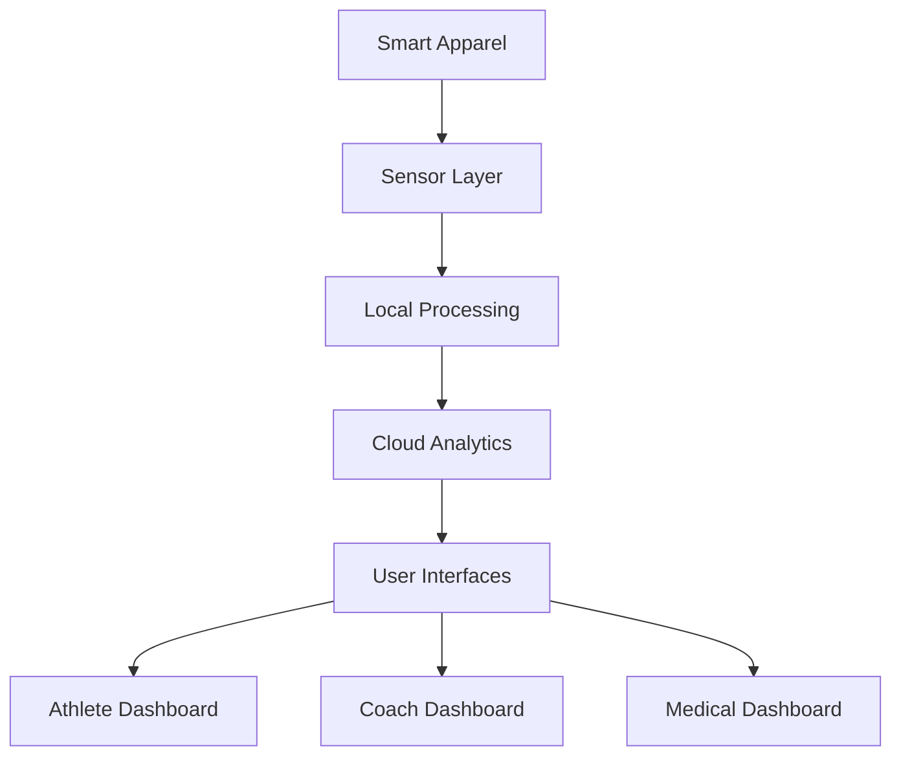

# Smart Apparel System

 <!-- v1.0.0 -->
 <!-- v1.0.0 -->
 <!-- v1.0.0 -->
 <!-- v1.0.0 -->
 <!-- v1.0.0 -->

Real-time athletic performance monitoring system using sensor-embedded apparel with advanced analytics capabilities for comprehensive biomechanical and physiological insights.

## Key Features

- Real-time muscle activity monitoring and analysis
- Kinematic data capture and processing using IMU and ToF sensors
- Statistical anomaly detection for injury prevention
- Interactive heat map visualization
- Team-wide performance analytics
- HIPAA-compliant data handling and storage
- Integration with EHR systems and team management platforms

## System Architecture



### Core Components

- **Sensor Layer**: IMU and ToF sensors for biomechanical data capture
- **Edge Processing**: ARM MCU with real-time signal processing
- **Cloud Platform**: AWS-based scalable infrastructure
- **Analytics Engine**: Python-based data processing pipeline
- **User Interfaces**: React web and React Native mobile applications

## Prerequisites

### Sensor Setup
- Sensor calibration tools
- BLE debugging tools

### Backend Development
- Node.js 18+
- Python 3.11+
- Docker 24+
- Kubernetes 1.27+

### Mobile Development
- iOS: Xcode 14+, Swift 5.9
- Android: Android Studio, Kotlin 1.9

### Web Development
- Node.js 18+
- React 18+
- TypeScript 5.0+

## Installation

1. Clone the repository:
```bash
git clone --recursive https://github.com/your-org/smart-apparel.git
cd smart-apparel
```

2. Configure sensor hardware:
   - Follow sensor calibration procedures in `/docs/sensor-setup.md`
   - Verify BLE connectivity
   - Configure initial sensor parameters

3. Set up development environment:
```bash
# Install dependencies
npm install
pip install -r requirements.txt

# Configure environment
cp .env.example .env
# Edit .env with your configuration

# Start development environment
docker-compose up
```

4. Initialize databases:
```bash
npm run migrate
```

5. Configure security certificates:
   - Set up SSL/TLS certificates
   - Configure authentication providers
   - Set up HIPAA compliance monitoring

6. Build and deploy:
```bash
# Build applications
npm run build

# Deploy to development
kubectl apply -f k8s/dev/
```

## Security & Compliance

### Data Protection
- Field-level encryption for sensitive data
- TLS 1.3 for all data transmission
- HIPAA-compliant data storage and processing
- GDPR-ready data handling capabilities

### Authentication & Authorization
- Multi-factor authentication support
- Role-based access control
- Secure session management
- OAuth 2.0 integration

### Monitoring & Auditing
- Comprehensive security logging
- Audit trails for all data access
- Real-time intrusion detection
- Automated compliance monitoring

## Contributing

Please read [CONTRIBUTING.md](CONTRIBUTING.md) for details on our code of conduct, development process, and submission guidelines.

## License

This project is licensed under the Smart-Apparel System Software License - see the [LICENSE](LICENSE) file for details.

## Support

For technical support or compliance questions:
- Documentation: `/docs`
- Issue Tracker: GitHub Issues
- Security: security@smart-apparel.com
- Compliance: compliance@smart-apparel.com

## Status & Roadmap

- Current Version: 1.0.0
- Status: Production-Ready
- Next Release: Q2 2024