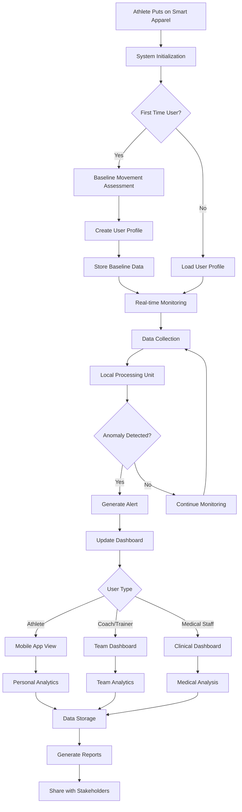
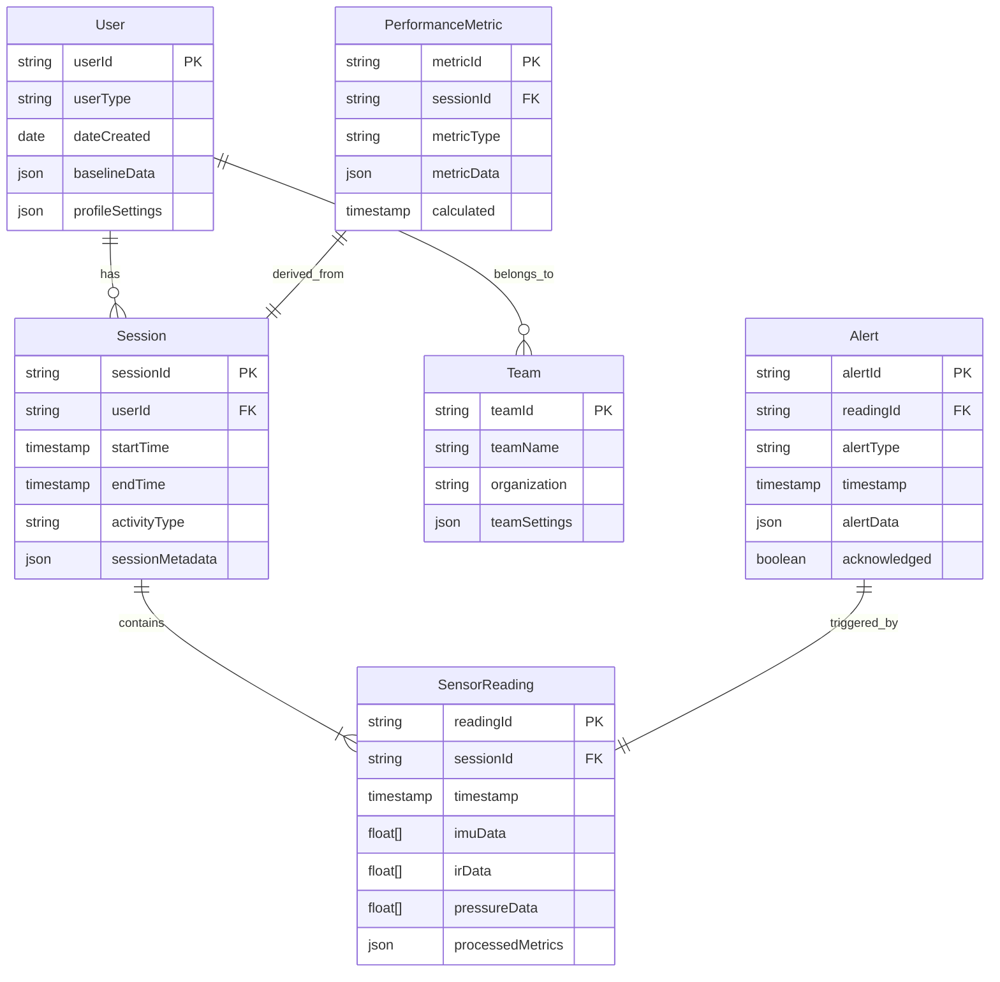
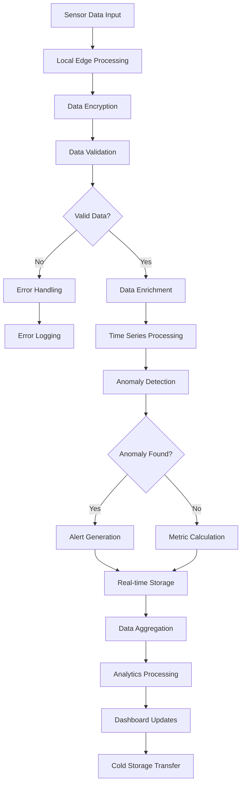
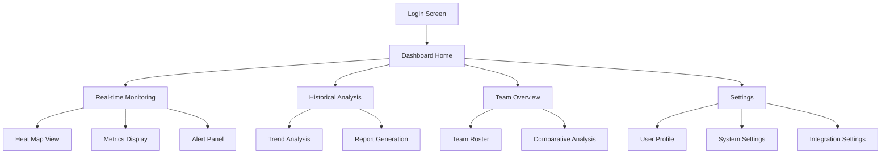

# Product Requirements Document (PRD)

# 1. INTRODUCTION

## 1.1 Purpose
This Software Requirements Specification (SRS) document provides a comprehensive description of the smart-apparel system and its companion dashboard application. It is intended for:
- Development team members
- Quality assurance engineers
- Project stakeholders
- Sports medicine professionals
- System architects
- UI/UX designers

## 1.2 Scope
The smart-apparel system consists of wearable garments embedded with infrared time-of-flight sensors and inertial measurement units, coupled with a real-time analytics dashboard. The system aims to:

### Core Functionalities
- Capture and analyze muscle activity patterns
- Monitor soft tissue characteristics
- Track kinematic metrics in real-time
- Generate heat maps of physiological data
- Detect statistical anomalies
- Establish baseline movement patterns
- Enable data sharing with healthcare professionals

### Key Benefits
- Early detection of muscle imbalances
- Real-time weight distribution analysis
- Fluid buildup monitoring
- Performance tracking for individual athletes
- Team-wide health and performance monitoring
- Integration with sports medicine workflows
- Support for rehabilitation programs

### Target Users
- Athletes (primary users)
- Coaches
- Athletic trainers
- Physical therapists
- Sports medicine professionals
- Team performance analysts

The system supports both individual athlete monitoring and team-wide performance analysis, with particular emphasis on young athletes' physical development and injury prevention.

# 2. PRODUCT DESCRIPTION

## 2.1 Product Perspective
The smart-apparel system operates within a larger ecosystem of sports performance and medical technology:

- **Hardware Layer**
  - Garments with embedded sensors
  - Infrared time-of-flight sensor network
  - Inertial measurement units (IMUs)
  - Local data processing units

- **Software Layer**
  - Real-time data collection engine
  - Analytics processing backend
  - Cloud-based data storage
  - Web-based dashboard interface
  - Mobile companion application

- **Integration Points**
  - Electronic Health Record (EHR) systems
  - Team management platforms
  - Training schedule systems
  - Existing fitness tracking ecosystems

## 2.2 Product Functions
- **Data Collection**
  - Continuous muscle activity monitoring
  - Real-time soft tissue analysis
  - Kinematic data capture
  - Movement pattern recording
  - Weight distribution tracking

- **Analysis Functions**
  - Baseline movement pattern establishment
  - Statistical anomaly detection
  - Muscle imbalance identification
  - Fluid retention analysis
  - Performance trend analysis

- **Visualization & Reporting**
  - Real-time heat mapping
  - Performance dashboards
  - Individual athlete reports
  - Team-wide analytics
  - Historical trend visualization

## 2.3 User Characteristics

### Athletes
- Age Range: 12-40 years
- Technical Proficiency: Basic to intermediate
- Usage Frequency: Daily
- Primary Focus: Personal performance metrics

### Coaches & Athletic Trainers
- Technical Proficiency: Intermediate
- Domain Expertise: High
- Usage Pattern: Regular monitoring and analysis
- Focus: Team performance and injury prevention

### Medical Professionals
- Technical Proficiency: Intermediate to advanced
- Clinical Expertise: High
- Usage Pattern: As-needed basis
- Focus: Injury assessment and rehabilitation

## 2.4 Constraints
- **Technical Constraints**
  - Sensor battery life limitations
  - Wireless data transmission bandwidth
  - Real-time processing capabilities
  - Data storage capacity

- **Regulatory Constraints**
  - HIPAA compliance requirements
  - Data privacy regulations
  - Youth athlete protection laws
  - Medical device regulations

- **Physical Constraints**
  - Garment durability requirements
  - Washing/maintenance limitations
  - Sensor placement restrictions
  - Environmental operating conditions

## 2.5 Assumptions and Dependencies
### Assumptions
- Users have consistent access to wireless internet
- Athletes can wear sensors during all relevant activities
- Medical professionals have access to compatible devices
- Base movement patterns remain consistent over time

### Dependencies
- Cloud service availability
- Third-party API stability
- Sensor manufacturer supply chain
- Mobile device OS compatibility
- Network infrastructure reliability
- Integration partner systems uptime

# 3. PROCESS FLOWCHART

# 4. FUNCTIONAL REQUIREMENTS

## 4.1 Data Collection Features

| ID | Description | Priority |
|---|---|---|
| DC-01 | System must capture muscle activity patterns through infrared time-of-flight sensors at minimum 100Hz | HIGH |
| DC-02 | System must record kinematic data through IMUs at minimum 200Hz sampling rate | HIGH |
| DC-03 | System must measure weight distribution across foot sensors with 0.1kg precision | HIGH |
| DC-04 | System must detect and measure soft tissue characteristics including fluid retention | MEDIUM |
| DC-05 | System must establish baseline movement patterns during initial setup | HIGH |

## 4.2 Real-time Processing Features

| ID | Description | Priority |
|---|---|---|
| RP-01 | System must process sensor data within 50ms latency | HIGH |
| RP-02 | System must detect statistical anomalies in movement patterns | HIGH |
| RP-03 | System must generate real-time heat maps of physiological data | HIGH |
| RP-04 | System must identify muscle imbalances compared to baseline | HIGH |
| RP-05 | System must calculate performance metrics during activity | MEDIUM |

## 4.3 Dashboard Features

| ID | Description | Priority |
|---|---|---|
| DB-01 | System must display real-time heat maps of muscle activity | HIGH |
| DB-02 | System must provide individual athlete performance metrics | HIGH |
| DB-03 | System must generate team-wide analytics views | HIGH |
| DB-04 | System must support customizable alert thresholds | MEDIUM |
| DB-05 | System must display historical trend analysis | MEDIUM |

## 4.4 Data Management Features

| ID | Description | Priority |
|---|---|---|
| DM-01 | System must securely store all collected data | HIGH |
| DM-02 | System must support data export in standard formats | MEDIUM |
| DM-03 | System must maintain user profiles and baseline data | HIGH |
| DM-04 | System must enable data sharing with authorized personnel | HIGH |
| DM-05 | System must backup data automatically | HIGH |

## 4.5 Integration Features

| ID | Description | Priority |
|---|---|---|
| IN-01 | System must integrate with EHR systems | MEDIUM |
| IN-02 | System must support API access for third-party applications | LOW |
| IN-03 | System must sync with mobile companion app | HIGH |
| IN-04 | System must integrate with team management platforms | MEDIUM |
| IN-05 | System must support standard fitness tracking protocols | LOW |

## 4.6 User Management Features

| ID | Description | Priority |
|---|---|---|
| UM-01 | System must support role-based access control | HIGH |
| UM-02 | System must manage user permissions and data access | HIGH |
| UM-03 | System must support multiple user types (athlete, coach, medical) | HIGH |
| UM-04 | System must enable team roster management | MEDIUM |
| UM-05 | System must support user authentication and authorization | HIGH |

# 5. NON-FUNCTIONAL REQUIREMENTS

## 5.1 Performance Requirements

| ID | Requirement | Target Metric |
|---|---|---|
| PF-01 | Maximum end-to-end latency | < 100ms |
| PF-02 | Dashboard refresh rate | ≥ 10 Hz |
| PF-03 | Concurrent user support | 1000 users per server instance |
| PF-04 | Data processing throughput | ≥ 1000 sensor readings per second |
| PF-05 | Mobile app response time | < 2 seconds for any operation |
| PF-06 | Battery life of sensors | Minimum 12 hours continuous use |
| PF-07 | System memory usage | < 500MB on mobile devices |
| PF-08 | Database query response time | < 500ms for 95% of queries |

## 5.2 Safety Requirements

| ID | Requirement | Description |
|---|---|---|
| SF-01 | Automatic data backup | Real-time backup with 99.99% data preservation |
| SF-02 | Failover system | Automatic switching to backup servers within 30 seconds |
| SF-03 | Data corruption prevention | Checksums and validation for all data transfers |
| SF-04 | Emergency shutdown | Graceful shutdown with data preservation on critical failure |
| SF-05 | Sensor malfunction detection | Automatic detection and isolation of faulty sensors |

## 5.3 Security Requirements

| ID | Requirement | Description |
|---|---|---|
| SC-01 | Data encryption | AES-256 encryption for data at rest and in transit |
| SC-02 | Authentication | Multi-factor authentication for all user types |
| SC-03 | Session management | Automatic timeout after 30 minutes of inactivity |
| SC-04 | Access control | Role-based access control with principle of least privilege |
| SC-05 | Audit logging | Comprehensive logging of all system access and changes |
| SC-06 | Data anonymization | Anonymization of sensitive data for research purposes |
| SC-07 | Secure communication | TLS 1.3 for all network communications |

## 5.4 Quality Requirements

### 5.4.1 Availability
- System uptime: 99.9% excluding scheduled maintenance
- Maximum planned downtime: 4 hours per month
- Recovery Time Objective (RTO): 1 hour
- Recovery Point Objective (RPO): 5 minutes

### 5.4.2 Maintainability
- Mean Time To Repair (MTTR): < 4 hours
- Automated deployment processes
- Modular architecture for easy component replacement
- Comprehensive system documentation

### 5.4.3 Usability
- Initial user training time: < 2 hours
- Task completion rate: > 90%
- Error rate: < 5% for common tasks
- Mobile app usability score: > 85/100 on standard usability scales

### 5.4.4 Scalability
- Linear scaling up to 100,000 concurrent users
- Storage scalability: Up to 10 years of historical data
- Processing scalability: Up to 10,000 sensors per server
- Horizontal scaling capability for cloud infrastructure

### 5.4.5 Reliability
- Mean Time Between Failures (MTBF): > 5000 hours
- Error rate: < 0.1% for sensor readings
- Data accuracy: > 99% for all measurements
- System stability: < 1 critical bug per month

## 5.5 Compliance Requirements

| ID | Requirement | Description |
|---|---|---|
| CP-01 | HIPAA compliance | Full compliance with all HIPAA regulations |
| CP-02 | GDPR compliance | Meeting all GDPR requirements for EU users |
| CP-03 | FDA regulations | Compliance with FDA guidelines for medical devices |
| CP-04 | Data retention | Meeting legal requirements for medical data retention |
| CP-05 | Youth protection | Compliance with youth athlete protection laws |
| CP-06 | ISO 13485 | Compliance with medical device quality standards |
| CP-07 | ISO 27001 | Information security management compliance |

# 6. DATA REQUIREMENTS

## 6.1 Data Models

## 6.2 Data Storage

### 6.2.1 Storage Requirements
- Primary Database: Time-series optimized database for sensor data
- Secondary Database: Document store for user profiles and configurations
- Cold Storage: Object storage for historical data older than 6 months
- Cache Layer: In-memory database for real-time analytics

### 6.2.2 Data Retention
- Real-time sensor data: 7 days in hot storage
- Processed metrics: 6 months in primary storage
- Historical data: 5 years in cold storage
- User profiles and baselines: Indefinite retention
- System logs: 1 year retention

### 6.2.3 Redundancy and Backup
- Real-time replication across 3 geographic regions
- Daily incremental backups
- Weekly full backups
- 30-day backup retention period
- Point-in-time recovery capability
- 99.999% durability guarantee

## 6.3 Data Processing

### 6.3.1 Data Security
- End-to-end encryption for all data in transit
- Field-level encryption for sensitive data
- Data anonymization for research purposes
- Access control based on data classification
- Automated data masking for non-production environments

### 6.3.2 Processing Requirements
- Real-time processing latency < 50ms
- Batch processing window: 4 hours
- Stream processing capability: 10,000 events/second
- Analytics computation: Near real-time
- Data aggregation: 5-minute intervals

### 6.3.3 Data Classification
| Classification Level | Data Types | Retention Period | Access Control |
|---------------------|------------|------------------|----------------|
| Critical | User authentication, Medical data | 5 years | Strict MFA |
| Sensitive | Performance metrics, Baseline data | 3 years | Role-based |
| Internal | Team statistics, Aggregated data | 1 year | Team-based |
| Public | Anonymous statistics | 6 months | Open access |

# 7. EXTERNAL INTERFACES

## 7.1 User Interfaces

### 7.1.1 Mobile Application Interface
- Native iOS and Android applications
- Minimum supported versions:
  - iOS 14.0 and above
  - Android 10.0 and above
- Responsive design supporting phones and tablets
- Dark/light mode support
- Accessibility compliance with WCAG 2.1 Level AA

### 7.1.2 Web Dashboard Interface
- Progressive Web Application (PWA)
- Support for modern browsers (Chrome, Firefox, Safari, Edge)
- Minimum screen resolution: 1280x720
- Responsive breakpoints:
  - Desktop: ≥1200px
  - Tablet: ≥768px
  - Mobile: ≥320px

### 7.1.3 Interface Components

## 7.2 Hardware Interfaces

### 7.2.1 Sensor Interfaces
- Infrared Time-of-Flight Sensors
  - Protocol: I2C
  - Sampling Rate: 100Hz
  - Resolution: 0.1mm
  - Operating Voltage: 3.3V

- Inertial Measurement Units
  - Protocol: SPI
  - Sampling Rate: 200Hz
  - Accelerometer Range: ±16g
  - Gyroscope Range: ±2000°/s

### 7.2.2 Local Processing Unit
- Microcontroller Requirements:
  - ARM Cortex-M4F or higher
  - Minimum 128KB RAM
  - Bluetooth 5.0 support
  - Real-time processing capability
  - Low-power modes

### 7.2.3 Connectivity Hardware
- Bluetooth Low Energy 5.0
  - Maximum Range: 100m
  - Data Rate: 2Mbps
  - Connection Latency: <10ms
  - Power Consumption: <10mA

## 7.3 Software Interfaces

### 7.3.1 API Specifications
- RESTful API
  - OpenAPI 3.0 specification
  - JSON data format
  - JWT authentication
  - Rate limiting: 1000 requests/minute
  - Endpoint versioning

### 7.3.2 Database Interfaces
- Time Series Database
  - InfluxDB 2.0 or higher
  - Query Interface: Flux
  - Retention Policies: Configurable
  
- Document Store
  - MongoDB 5.0 or higher
  - Connection Pool: 100 connections
  - Replica Set: 3 nodes

### 7.3.3 Third-party Integrations
- Electronic Health Record Systems
  - HL7 FHIR standard
  - HIPAA-compliant interfaces
  
- Team Management Platforms
  - OAuth 2.0 authentication
  - Webhook support
  - Bulk data synchronization

## 7.4 Communication Interfaces

### 7.4.1 Network Protocols
- Data Transport
  - HTTPS (TLS 1.3)
  - WebSocket (WSS)
  - MQTT 5.0
  - gRPC

### 7.4.2 Data Exchange Formats
| Format | Use Case | Schema Version |
|--------|----------|----------------|
| JSON | REST API | 2.0 |
| Protocol Buffers | Sensor Data | 3.0 |
| BSON | Database Storage | 1.0 |
| HL7 FHIR | Medical Data | R4 |

### 7.4.3 Communication Security
- TLS 1.3 for all network traffic
- Certificate-based authentication
- Perfect Forward Secrecy (PFS)
- Mutual TLS for service-to-service communication
- API key rotation every 90 days

# 8. APPENDICES

## 8.1 GLOSSARY

| Term | Definition |
|------|------------|
| Baseline Movement Pattern | Initial movement assessment used to establish standard metrics for an individual athlete |
| Edge Processing | Data processing that occurs on local hardware before cloud transmission |
| Heat Map | Visual representation of data where values are depicted by color intensity |
| Kinematic Metrics | Measurements related to motion without reference to mass or force |
| Muscle Imbalance | Condition where muscles on one side of a joint are stronger than the opposing muscles |
| Soft Tissue Characteristics | Properties of muscles, tendons, and connective tissues |
| Statistical Anomaly | Data point or pattern that significantly deviates from the established baseline |
| Time-of-Flight | Technology that measures distance based on the time taken for infrared light to bounce back from a target |
| Weight Distribution | Pattern of how body weight is spread across contact points during movement |

## 8.2 ACRONYMS

| Acronym | Full Form |
|---------|-----------|
| AES | Advanced Encryption Standard |
| API | Application Programming Interface |
| BSON | Binary JSON |
| EHR | Electronic Health Record |
| FHIR | Fast Healthcare Interoperability Resources |
| GDPR | General Data Protection Regulation |
| HIPAA | Health Insurance Portability and Accountability Act |
| HL7 | Health Level Seven |
| IMU | Inertial Measurement Unit |
| I2C | Inter-Integrated Circuit |
| JSON | JavaScript Object Notation |
| JWT | JSON Web Token |
| MFA | Multi-Factor Authentication |
| MQTT | Message Queuing Telemetry Transport |
| PWA | Progressive Web Application |
| REST | Representational State Transfer |
| RPO | Recovery Point Objective |
| RTO | Recovery Time Objective |
| SPI | Serial Peripheral Interface |
| TLS | Transport Layer Security |
| WCAG | Web Content Accessibility Guidelines |
| WSS | WebSocket Secure |

## 8.3 ADDITIONAL REFERENCES

| Reference | Description | URL/Location |
|-----------|-------------|--------------|
| ISO 13485 | Medical Devices Quality Management Systems | www.iso.org/standard/59752.html |
| ISO 27001 | Information Security Management | www.iso.org/standard/27001 |
| HL7 FHIR Documentation | Healthcare Data Exchange Standards | www.hl7.org/fhir |
| WCAG 2.1 Guidelines | Web Accessibility Standards | www.w3.org/WAI/standards-guidelines/wcag |
| FDA Medical Device Guidance | Regulatory Guidelines for Medical Devices | www.fda.gov/medical-devices |
| Bluetooth 5.0 Specification | Wireless Communication Protocol | www.bluetooth.com/specifications |
| OpenAPI 3.0 Specification | API Documentation Standard | www.openapis.org |
| HIPAA Security Rule | Healthcare Data Security Requirements | www.hhs.gov/hipaa |