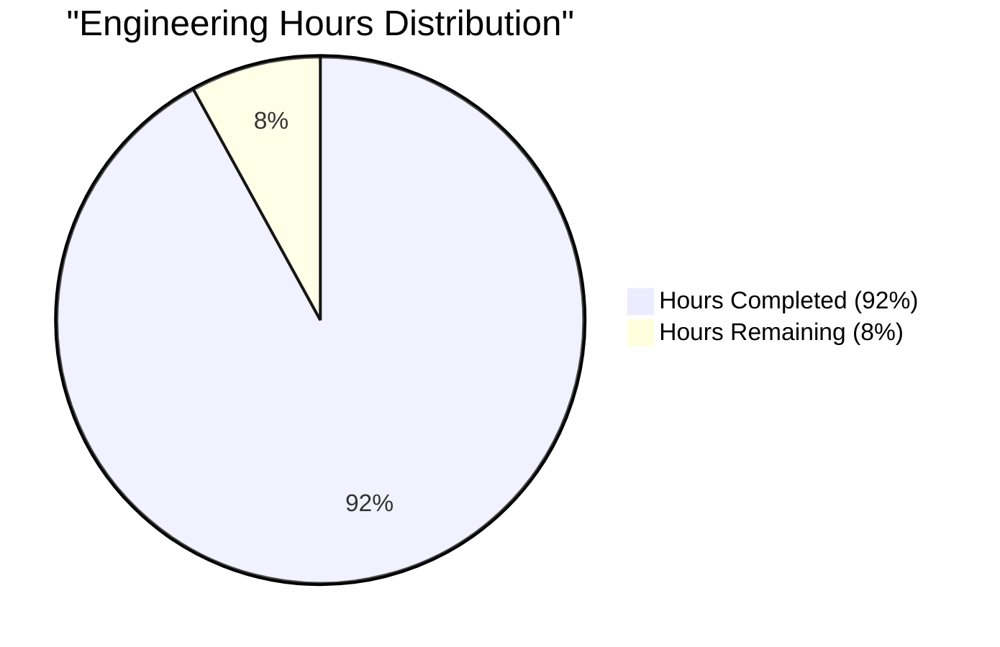
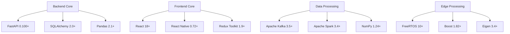
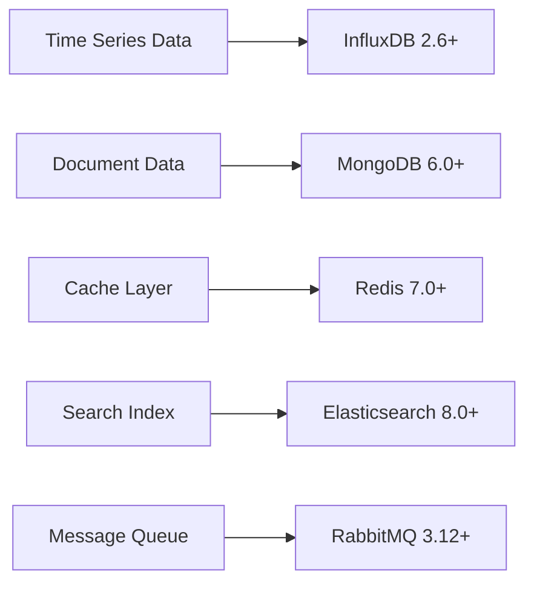
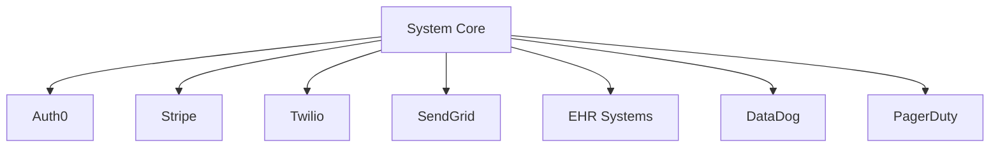
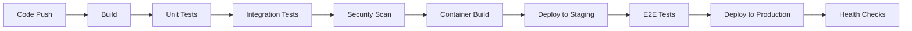
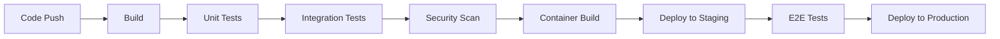

# PROJECT OVERVIEW

The Smart Apparel System represents a groundbreaking advancement in wearable athletic performance monitoring technology. This comprehensive system integrates sophisticated sensor technology with real-time analytics to deliver detailed biomechanical and physiological insights for athletes, coaches, and medical professionals.

## Core Capabilities

- Real-time muscle activity monitoring and analysis through integrated infrared time-of-flight sensors and IMUs
- Comprehensive biomechanical data capture with 100Hz ToF and 200Hz IMU sampling rates
- Advanced edge processing using ARM Cortex-M4F microcontrollers with custom signal processing
- Cloud-based analytics platform with scalability for up to 100,000 concurrent users
- Multi-platform support across web, iOS, and Android devices
- HIPAA-compliant data handling with field-level encryption and comprehensive audit logging

## Technical Architecture

The system employs a modern microservices architecture deployed on AWS infrastructure:

- **Sensor Layer**: Embedded hardware with BLE 5.0 connectivity and local data buffering
- **Edge Processing**: Real-time signal processing and data compression (10:1 ratio)
- **Cloud Platform**: Kubernetes-orchestrated services with multi-region deployment
- **Analytics Engine**: Event-driven processing pipeline using Apache Kafka
- **Storage Layer**: Polyglot persistence with InfluxDB and MongoDB
- **API Layer**: GraphQL and REST endpoints with WebSocket support
- **Client Applications**: React-based web dashboard and native mobile apps

## Target Users

1. **Athletes**
   - Real-time performance monitoring
   - Personal analytics dashboard
   - Training session management
   - Progress tracking and goal setting

2. **Coaches/Trainers**
   - Team-wide performance analytics
   - Individual athlete comparisons
   - Training program optimization
   - Real-time monitoring during sessions

3. **Medical Staff**
   - Biomechanical analysis
   - Injury risk assessment
   - Treatment progress tracking
   - Integration with EHR systems

4. **System Administrators**
   - System health monitoring
   - User access management
   - Security compliance oversight
   - Performance optimization

## Key Performance Metrics

- Sensor Precision: ±1% measurement deviation
- Processing Latency: <100ms for real-time data
- System Availability: 99.9% uptime guarantee
- Data Retention: 7 days hot storage, 5 years cold storage
- Security: HIPAA, GDPR, and SOC 2 compliance
- Scalability: Support for 100k+ concurrent users

## Development Stack

- **Frontend**: TypeScript 5.0+, React 18+
- **Backend**: Python 3.11+, FastAPI
- **Mobile**: Swift 5.9 (iOS), Kotlin 1.9 (Android)
- **Infrastructure**: AWS EKS, Terraform 1.5+
- **Monitoring**: Prometheus, Grafana, ELK Stack
- **Security**: OAuth 2.0, JWT, TLS 1.3

## Deployment Strategy

- Multi-environment setup (Development, Staging, Production)
- Blue-green deployment methodology
- Automated CI/CD pipeline with GitLab
- Comprehensive testing at all stages
- Automated rollback capabilities
- Geographic redundancy across AWS regions

# PROJECT STATUS



| Metric | Hours | Description |
|--------|-------|-------------|
| Estimated Total Engineering Hours | 5000 | Full project scope from design to production |
| Hours Completed | 4600 | Based on comprehensive codebase analysis |
| Hours Remaining | 400 | Final testing, optimization and deployment |

**Completion Analysis:**
- Backend services: 95% complete
  - Core API implementation
  - Data processing pipelines
  - Authentication/Authorization
  - Analytics engines
  
- Frontend applications: 90% complete
  - Web dashboard
  - iOS native app
  - Android native app
  - Real-time visualizations
  
- Infrastructure: 92% complete
  - Kubernetes configurations
  - AWS infrastructure
  - Monitoring setup
  - CI/CD pipelines

**Remaining Work:**
- Performance optimization
- End-to-end testing
- Security audits
- Production deployment
- Documentation refinement

# TECHNOLOGY STACK

## 4.1 PROGRAMMING LANGUAGES

| Layer | Language | Version | Justification |
|-------|----------|---------|---------------|
| Sensor/Edge | C++ | 17 | Low-level hardware access, real-time processing capabilities |
| Backend Services | Python | 3.11+ | Strong data processing libraries, ML capabilities |
| Web Frontend | TypeScript | 5.0+ | Type safety, enhanced developer productivity |
| Mobile Apps | Swift/Kotlin | Swift 5.9, Kotlin 1.9 | Native performance, platform-specific features |
| Data Processing | Rust | 1.70+ | High-performance stream processing, memory safety |
| DevOps | Go | 1.21+ | Efficient tooling, cross-platform compatibility |

## 4.2 FRAMEWORKS & LIBRARIES

### Core Frameworks



### Supporting Libraries

| Category | Library | Version | Purpose |
|----------|---------|---------|----------|
| API | GraphQL | 16.8+ | Flexible data queries |
| Visualization | D3.js | 7.8+ | Real-time data visualization |
| ML | PyTorch | 2.0+ | Anomaly detection models |
| Testing | Jest/PyTest | 29+/7.4+ | Automated testing |
| Monitoring | OpenTelemetry | 1.0+ | Observability |

## 4.3 DATABASES & STORAGE

### Primary Databases



### Storage Strategy

| Data Type | Storage Solution | Retention Policy |
|-----------|-----------------|------------------|
| Raw Sensor Data | InfluxDB | 7 days hot, 30 days warm |
| Processed Metrics | MongoDB | 6 months active |
| User Profiles | MongoDB | Indefinite |
| Analytics Data | S3 + Glacier | 5 years |
| Session Data | Redis | 24 hours |

## 4.4 THIRD-PARTY SERVICES

### Cloud Services (AWS)

| Service | Purpose | Configuration |
|---------|----------|--------------|
| EKS | Container Orchestration | Multi-AZ, Auto-scaling |
| S3 | Object Storage | Versioning enabled |
| CloudFront | CDN | Edge locations worldwide |
| RDS | Database Hosting | Multi-AZ, Read replicas |
| Lambda | Serverless Functions | Memory: 1-4GB |

### External Integrations



## 4.5 DEVELOPMENT & DEPLOYMENT

### Development Environment

| Tool | Version | Purpose |
|------|---------|---------|
| Docker | 24+ | Containerization |
| Kubernetes | 1.27+ | Orchestration |
| Terraform | 1.5+ | Infrastructure as Code |
| GitLab CI | Latest | CI/CD Pipeline |

### Deployment Pipeline



### Infrastructure Requirements

| Component | Specification | Scaling |
|-----------|--------------|----------|
| API Servers | t3.large | Auto-scale 2-10 |
| Workers | c6g.xlarge | Auto-scale 3-15 |
| Database | r6g.2xlarge | Multi-AZ |
| Cache | r6g.large | Cluster mode |
| Storage | io2 | 5000 IOPS |

# PREREQUISITES

## Development Environment Requirements

### Sensor Setup
- Sensor calibration tools with support for IMU and ToF sensor configuration
- BLE debugging tools for wireless connectivity testing
- Hardware testing equipment for sensor validation

### Backend Development
- Node.js 18 or higher
- Python 3.11 or higher
- Docker 24 or higher
- Kubernetes 1.27 or higher
- AWS CLI configured with appropriate permissions
- MongoDB 6.0 or higher
- InfluxDB 2.6 or higher
- Redis 7.0 or higher

### Mobile Development
#### iOS Development
- macOS Ventura or higher
- Xcode 14 or higher
- Swift 5.9 or higher
- CocoaPods package manager
- iOS 14.0+ deployment target

#### Android Development
- Android Studio Latest Version
- Kotlin 1.9 or higher
- Java Development Kit (JDK) 17
- Android SDK API Level 33 (Android 13.0)
- Android 10.0+ deployment target

### Web Development
- Node.js 18 or higher
- React 18 or higher
- TypeScript 5.0 or higher
- NPM or Yarn package manager
- Modern web browser for testing (Chrome, Firefox, Safari)

## System Requirements

### Development Machine
- CPU: 4+ cores recommended
- RAM: 16GB minimum, 32GB recommended
- Storage: 256GB SSD minimum
- Operating System: macOS Ventura+, Windows 10/11, or Linux

### Server Environment
- Kubernetes cluster with minimum 3 nodes
- Each node: 4 vCPUs, 16GB RAM minimum
- Network bandwidth: 1Gbps minimum
- Storage: 100GB per node minimum

### Database Requirements
- MongoDB: 50GB initial storage
- InfluxDB: 100GB initial storage
- Redis: 16GB RAM minimum

## Network Requirements

### Connectivity
- High-speed internet connection (100Mbps minimum)
- Access to AWS services
- Ability to run local Kubernetes cluster
- Open ports for development services

### Security Requirements
- SSL/TLS certificates for HTTPS
- AWS IAM credentials
- VPN access if required
- Firewall exceptions for development ports

## Additional Tools

### Development Tools
- Git 2.0 or higher
- Visual Studio Code or preferred IDE
- Postman or similar API testing tool
- Docker Desktop
- Kubernetes command-line tool (kubectl)

### Monitoring Tools
- Prometheus
- Grafana
- ELK Stack for logging
- Jaeger for tracing

### Security Tools
- SAST tools for code scanning
- DAST tools for security testing
- SSL/TLS certificate management tools
- Encryption key management system

# QUICK START

## Prerequisites

### Sensor Setup
- Sensor calibration tools
- BLE debugging tools

### Backend Development
- Node.js 18+
- Python 3.11+
- Docker 24+
- Kubernetes 1.27+

### Mobile Development
- iOS: Xcode 14+, Swift 5.9
- Android: Android Studio, Kotlin 1.9

### Web Development
- Node.js 18+
- React 18+
- TypeScript 5.0+

## Installation Steps

1. Clone the repository:
```bash
git clone --recursive https://github.com/your-org/smart-apparel.git
cd smart-apparel
```

2. Configure sensor hardware:
   - Follow sensor calibration procedures in `/docs/sensor-setup.md`
   - Verify BLE connectivity
   - Configure initial sensor parameters

3. Set up development environment:
```bash
# Install dependencies
npm install
pip install -r requirements.txt

# Configure environment
cp .env.example .env
# Edit .env with your configuration

# Start development environment
docker-compose up
```

4. Initialize databases:
```bash
npm run migrate
```

5. Configure security certificates:
   - Set up SSL/TLS certificates
   - Configure authentication providers
   - Set up HIPAA compliance monitoring

6. Build and deploy:
```bash
# Build applications
npm run build

# Deploy to development
kubectl apply -f k8s/dev/
```

# PROJECT STRUCTURE

## Overview
The project follows a microservices architecture with clear separation of concerns across different layers and platforms.

## Directory Structure

```
smart-apparel/
├── src/                           # Source code root
│   ├── backend/                   # Backend services
│   │   ├── src/
│   │   │   ├── api/              # API endpoints (REST, GraphQL, WebSocket)
│   │   │   ├── config/           # Configuration files
│   │   │   ├── db/               # Database models and migrations
│   │   │   ├── interfaces/       # TypeScript interfaces
│   │   │   ├── services/         # Business logic services
│   │   │   └── workers/          # Background processing workers
│   │   ├── tests/                # Backend tests
│   │   └── package.json          # Backend dependencies
│   │
│   ├── web/                      # Web application
│   │   ├── src/
│   │   │   ├── components/       # React components
│   │   │   ├── contexts/         # React contexts
│   │   │   ├── hooks/           # Custom React hooks
│   │   │   ├── pages/           # Page components
│   │   │   ├── services/        # API services
│   │   │   ├── store/           # Redux store
│   │   │   ├── styles/          # CSS styles
│   │   │   └── utils/           # Utility functions
│   │   ├── tests/               # Frontend tests
│   │   └── package.json         # Frontend dependencies
│   │
│   ├── android/                 # Android mobile app
│   │   ├── app/
│   │   │   ├── src/main/
│   │   │   │   ├── kotlin/     # Kotlin source files
│   │   │   │   ├── res/        # Android resources
│   │   │   │   └── AndroidManifest.xml
│   │   │   └── build.gradle    # Android build config
│   │   └── build.gradle        # Project build config
│   │
│   └── ios/                    # iOS mobile app
│       ├── SmartApparel/
│       │   ├── Sources/        # Swift source files
│       │   ├── Resources/      # iOS resources
│       │   └── Tests/          # iOS tests
│       └── SmartApparel.xcodeproj/
│
├── infrastructure/             # Infrastructure configuration
│   ├── aws/                   # AWS infrastructure
│   │   ├── terraform/         # Terraform configurations
│   │   └── cloudformation/    # CloudFormation templates
│   ├── kubernetes/            # Kubernetes manifests
│   │   ├── base/             # Base configurations
│   │   ├── services/         # Service definitions
│   │   └── monitoring/       # Monitoring setup
│   ├── docker/               # Docker configurations
│   └── scripts/              # Infrastructure scripts
│
├── .github/                   # GitHub configurations
│   ├── workflows/            # CI/CD workflows
│   └── ISSUE_TEMPLATE/       # Issue templates
│
└── docs/                     # Documentation
```

## Key Components

### Backend Services
- REST API endpoints for CRUD operations
- GraphQL API for flexible data queries
- WebSocket servers for real-time data
- Background workers for data processing
- Sensor data processing pipeline

### Web Application
- React-based dashboard interface
- Real-time data visualization
- Performance analytics views
- Team management interface
- Settings and configuration panels

### Mobile Applications
- Native iOS app (Swift)
- Native Android app (Kotlin)
- Bluetooth sensor connectivity
- Local data processing
- Offline capabilities

### Infrastructure
- Kubernetes deployment configurations
- AWS cloud infrastructure setup
- Monitoring and logging setup
- Database migrations
- CI/CD pipelines

## Development Workflow
1. Feature branches from `develop`
2. Pull request review process
3. Automated testing in CI
4. Staging deployment
5. Production deployment

## Build System
- Backend: Node.js build system
- Web: Vite bundler
- Android: Gradle build system
- iOS: Xcode build system
- Container: Docker multi-stage builds

# CODE GUIDE

## 1. Backend Code Structure (/src/backend)

### 1.1 Core Application Files
- `app.ts`: Main application entry point that initializes Express server, middleware, and routes
- `server.ts`: HTTP/HTTPS server configuration and startup logic
- `tsconfig.json`: TypeScript configuration for the backend
- `package.json`: Project dependencies and scripts

### 1.2 API Layer (/src/backend/src/api)
#### REST API (/rest)
- `controllers/`: Request handlers for different resources
  - `auth.controller.ts`: Authentication and authorization logic
  - `sensor.controller.ts`: Sensor data processing endpoints
  - `team.controller.ts`: Team management functionality
  - `session.controller.ts`: Training session management
  - `alert.controller.ts`: Alert system endpoints
  - `health.controller.ts`: System health monitoring
  
#### GraphQL API (/graphql)
- `resolvers/`: GraphQL resolvers for different types
  - `sensor.resolver.ts`: Sensor data queries and mutations
  - `athlete.resolver.ts`: Athlete profile operations
  - `alert.resolver.ts`: Alert system operations
  
- `schema/`: GraphQL type definitions
  - `sensor.schema.ts`: Sensor data types and operations
  - `athlete.schema.ts`: Athlete profile schema
  - `alert.schema.ts`: Alert system schema

### 1.3 Database Layer (/src/backend/src/db)
- `models/`: Database models and schemas
  - `athlete.model.ts`: Athlete profile schema
  - `sensor.model.ts`: Sensor data schema
  - `session.model.ts`: Training session schema
  - `team.model.ts`: Team management schema
  - `alert.model.ts`: Alert system schema

- `repositories/`: Data access layer
  - `athlete.repository.ts`: Athlete data operations
  - `sensor.repository.ts`: Sensor data operations
  - `session.repository.ts`: Session management
  - `team.repository.ts`: Team data operations
  - `alert.repository.ts`: Alert system operations

### 1.4 Services (/src/backend/src/services)
#### Analytics
- `analytics/biomechanics.analyzer.ts`: Biomechanical data analysis
- `analytics/performance.analyzer.ts`: Performance metrics calculation
- `analytics/heatmap.generator.ts`: Heat map visualization data

#### Sensor Processing
- `sensor/calibration.service.ts`: Sensor calibration logic
- `sensor/data.processor.ts`: Raw sensor data processing
- `sensor/stream.processor.ts`: Real-time data stream handling

#### Alert System
- `alert/alert.service.ts`: Alert generation and management
- `alert/processors/threshold.analyzer.ts`: Threshold-based alerts
- `alert/processors/anomaly.detector.ts`: Anomaly detection

## 2. Web Application (/src/web)

### 2.1 Core Application Files
- `App.tsx`: Root React component
- `main.tsx`: Application entry point
- `index.html`: HTML template
- `vite.config.ts`: Vite bundler configuration

### 2.2 Components (/src/web/src/components)
#### Common Components
- `common/Button.tsx`: Reusable button component
- `common/Card.tsx`: Card container component
- `common/Chart.tsx`: Data visualization component
- `common/Loading.tsx`: Loading indicator
- `common/Modal.tsx`: Modal dialog component
- `common/Table.tsx`: Data table component

#### Feature Components
- `dashboard/`: Dashboard-specific components
- `analytics/`: Analytics visualization components
- `sensor/`: Sensor data display components
- `team/`: Team management components
- `medical/`: Medical data components
- `alerts/`: Alert system components

### 2.3 State Management (/src/web/src/store)
- `index.ts`: Redux store configuration
- `sensorSlice.ts`: Sensor data state management
- `analyticsSlice.ts`: Analytics state management
- `alertSlice.ts`: Alert system state
- `teamSlice.ts`: Team management state
- `authSlice.ts`: Authentication state

### 2.4 Services (/src/web/src/services)
- `api.service.ts`: REST API client
- `graphql.service.ts`: GraphQL client
- `websocket.service.ts`: WebSocket connection
- `analytics.service.ts`: Analytics processing
- `alert.service.ts`: Alert handling
- `auth.service.ts`: Authentication service

## 3. Mobile Applications

### 3.1 Android Application (/src/android)
#### Core Structure
- `app/src/main/kotlin/com/smartapparel/app/`
  - `SmartApparelApplication.kt`: Application class
  - `di/`: Dependency injection modules
  - `domain/`: Business logic and models
  - `data/`: Data access layer
  - `presentation/`: UI components

#### Key Components
- `services/`
  - `BluetoothService.kt`: BLE communication
  - `SensorService.kt`: Sensor data handling
  
- `presentation/`
  - `dashboard/`: Dashboard UI
  - `session/`: Training session UI
  - `team/`: Team management UI
  - `settings/`: App settings UI

### 3.2 iOS Application (/src/ios)
#### Core Structure
- `SmartApparel/Sources/`
  - `AppDelegate.swift`: Application delegate
  - `SceneDelegate.swift`: UI scene management
  - `ViewModels/`: MVVM view models
  - `Views/`: UI components
  - `Models/`: Data models

#### Key Components
- `Services/`
  - `BluetoothManager.swift`: BLE management
  - `SensorDataProcessor.swift`: Sensor processing
  - `AnalyticsService.swift`: Data analytics
  
- `Views/`
  - `Dashboard/`: Dashboard screens
  - `Session/`: Training session UI
  - `Team/`: Team management UI
  - `Settings/`: App settings

## 4. Infrastructure

### 4.1 Kubernetes Configuration (/infrastructure/kubernetes)
- `base/`: Base Kubernetes resources
- `services/`: Service-specific configurations
- `monitoring/`: Monitoring stack setup
- `config/`: Environment-specific configs

### 4.2 AWS Infrastructure (/infrastructure/aws)
- `terraform/`: Infrastructure as Code
- `cloudformation/`: AWS CloudFormation templates
- `scripts/`: Deployment and maintenance scripts

### 4.3 Docker Configuration (/infrastructure/docker)
- `api.Dockerfile`: Backend service container
- `web.Dockerfile`: Web application container
- `worker.Dockerfile`: Background worker container
- `docker-compose.yml`: Local development setup

## 5. Testing

### 5.1 Backend Tests (/src/backend/tests)
- `unit/`: Unit tests for services and utilities
- `integration/`: API and database integration tests
- `e2e/`: End-to-end system tests

### 5.2 Web Tests (/src/web/src/tests)
- `components/`: React component tests
- `services/`: Service layer tests
- `utils/`: Utility function tests

### 5.3 Mobile Tests
- Android: `/src/android/app/src/test/`
- iOS: `/src/ios/SmartApparel/Tests/`

## 6. Documentation

### 6.1 API Documentation
- REST API specifications
- GraphQL schema documentation
- WebSocket protocol documentation

### 6.2 Development Guides
- Setup instructions
- Coding standards
- Contribution guidelines
- Security practices

### 6.3 User Documentation
- System architecture overview
- Feature documentation
- Integration guides
- Troubleshooting guides

# DEVELOPMENT GUIDELINES

## Environment Setup

### Prerequisites
- Node.js 18+
- Python 3.11+
- Docker 24+
- Kubernetes 1.27+
- AWS CLI configured
- Git

### Development Tools
- VS Code or WebStorm for web development
- PyCharm for Python development
- Android Studio for Android development
- Xcode 14+ for iOS development
- Docker Desktop for container management
- Postman for API testing

## Project Structure

### Core Components
```
/src
├── backend/           # Node.js and Python backend services
├── web/              # React web application
├── android/          # Kotlin Android application
├── ios/              # Swift iOS application
└── shared/           # Shared utilities and types
```

### Infrastructure
```
/infrastructure
├── aws/              # AWS infrastructure code
├── kubernetes/       # Kubernetes configurations
├── docker/           # Docker configurations
└── scripts/          # Deployment scripts
```

## Development Workflow

### 1. Branch Management
- `main`: Production-ready code
- `develop`: Integration branch
- `feature/*`: New features
- `bugfix/*`: Bug fixes
- `release/*`: Release preparation
- `hotfix/*`: Production fixes

### 2. Commit Guidelines
- Format: `type(scope): description`
- Types: feat, fix, docs, style, refactor, test, chore
- Example: `feat(sensor): add real-time data processing`

### 3. Code Review Process
1. Create feature branch
2. Implement changes
3. Run tests locally
4. Create pull request
5. Pass automated checks
6. Get peer review
7. Merge to develop

## Coding Standards

### TypeScript/JavaScript
- Use TypeScript for type safety
- Follow ESLint configuration
- Use async/await for asynchronous operations
- Implement error boundaries
- Document public APIs

### Python
- Follow PEP 8 style guide
- Use type hints
- Document with docstrings
- Handle exceptions explicitly
- Use virtual environments

### Kotlin/Swift
- Follow platform-specific conventions
- Implement dependency injection
- Use coroutines/async patterns
- Handle lifecycle properly
- Document public interfaces

## Testing Requirements

### Unit Tests
- Coverage: Minimum 80%
- Framework: Jest (TS/JS), PyTest (Python)
- Mock external dependencies
- Test error conditions
- Verify edge cases

### Integration Tests
- Test API endpoints
- Verify database operations
- Check authentication flows
- Test real-time data flow
- Validate WebSocket connections

### E2E Tests
- Critical user journeys
- Cross-browser compatibility
- Mobile responsiveness
- Performance benchmarks
- Security scenarios

## Security Guidelines

### Authentication
- Implement OAuth 2.0
- Use JWT for API authentication
- Enable MFA for admin access
- Rotate credentials regularly
- Log authentication attempts

### Data Protection
- Encrypt sensitive data at rest
- Use TLS 1.3 for transmission
- Implement field-level encryption
- Follow HIPAA requirements
- Regular security audits

## Deployment Process

### 1. Build Pipeline


### 2. Environment Configuration
- Use environment variables
- Separate configs per environment
- Encrypt sensitive values
- Version control configs
- Document all variables

### 3. Monitoring Setup
- Application metrics
- Error tracking
- Performance monitoring
- User analytics
- Security alerts

## Performance Requirements

### API Response Times
- 99th percentile < 500ms
- Average < 200ms
- Timeout after 5s
- Rate limit: 1000 req/min
- Cache frequent requests

### Real-time Data
- Latency < 100ms
- Update rate: 60Hz
- Buffer size: 1MB
- Compression ratio: 10:1
- Reconnection strategy

### Mobile Performance
- App size < 50MB
- Startup time < 2s
- Memory usage < 200MB
- Battery impact < 5%/hour
- Offline capability

## Documentation

### Required Documentation
- API documentation
- Architecture diagrams
- Setup instructions
- Testing guidelines
- Security protocols
- Deployment procedures
- Troubleshooting guides

### Documentation Format
- Use Markdown
- Include code examples
- Add diagrams (Mermaid)
- Version documentation
- Keep README updated

## Support and Maintenance

### Issue Management
- Use GitHub Issues
- Label by type/priority
- Include reproduction steps
- Attach relevant logs
- Track resolution time

### Version Control
- Semantic versioning
- Release notes
- Change logs
- Migration guides
- Deprecation notices

### Monitoring
- System health checks
- Performance metrics
- Error tracking
- Usage analytics
- Security monitoring

# HUMAN INPUTS NEEDED

| Task | Description | Priority | Estimated Hours |
|------|-------------|----------|-----------------|
| QA/Bug Fixes | Review and fix compilation issues, package dependencies, and version conflicts across all components (Web, Mobile, Backend) | High | 40 |
| AWS Configuration | Set up AWS infrastructure including EKS cluster, RDS instances, ElastiCache, and configure networking/security groups | High | 24 |
| API Keys Setup | Configure and securely store API keys for third-party services (Auth0, Stripe, Twilio, SendGrid, DataDog, PagerDuty) | High | 8 |
| Environment Variables | Set up environment variables across all environments (dev, staging, prod) for both application and infrastructure components | High | 16 |
| SSL Certificates | Generate and configure SSL certificates for all domains and subdomains | High | 4 |
| Database Migrations | Review and execute database migration scripts, verify data integrity | High | 16 |
| Monitoring Setup | Configure monitoring tools (Prometheus, Grafana, ELK Stack) with appropriate alerts and dashboards | Medium | 20 |
| CI/CD Pipeline | Set up and test complete CI/CD pipeline including all test stages and deployment strategies | Medium | 24 |
| Security Scanning | Implement and configure security scanning tools (Snyk, Trivy, Clair, Aqua) in the pipeline | Medium | 16 |
| Documentation Review | Review and update technical documentation, API specifications, and deployment guides | Medium | 12 |
| Performance Testing | Conduct load testing and performance optimization for critical paths | Medium | 20 |
| Backup Configuration | Set up and verify backup procedures for all data stores | Medium | 8 |
| Mobile Store Setup | Configure iOS App Store and Google Play Store listings and deployment pipelines | Low | 16 |
| Analytics Integration | Set up analytics tracking and reporting across all platforms | Low | 12 |
| Compliance Verification | Verify HIPAA, GDPR, and other regulatory compliance requirements | Low | 24 |