# Technical Specifications

# 1. INTRODUCTION

## 1.1 EXECUTIVE SUMMARY

The smart-apparel system represents a breakthrough in wearable athletic performance monitoring, combining advanced sensor technology with real-time analytics to provide comprehensive biomechanical and physiological insights. By integrating infrared time-of-flight sensors and inertial measurement units into athletic wear, the system enables continuous monitoring of muscle activity, soft tissue characteristics, and movement patterns.

This solution addresses the critical need for objective, real-time performance monitoring and injury prevention in athletic environments, particularly for young athletes. The system serves multiple stakeholders including athletes, coaches, athletic trainers, and medical professionals, providing them with actionable insights through customized dashboards and analytics platforms.

## 1.2 SYSTEM OVERVIEW

### Project Context
| Aspect | Description |
|--------|-------------|
| Market Position | First-to-market comprehensive biomechanical monitoring solution for athletic performance |
| Target Market | Youth athletics, professional sports, sports medicine facilities |
| Competitive Advantage | Integration of multiple sensor types with real-time analytics and medical professional access |
| Enterprise Integration | Connects with existing EHR systems, team management platforms, and training systems |

### High-Level Description

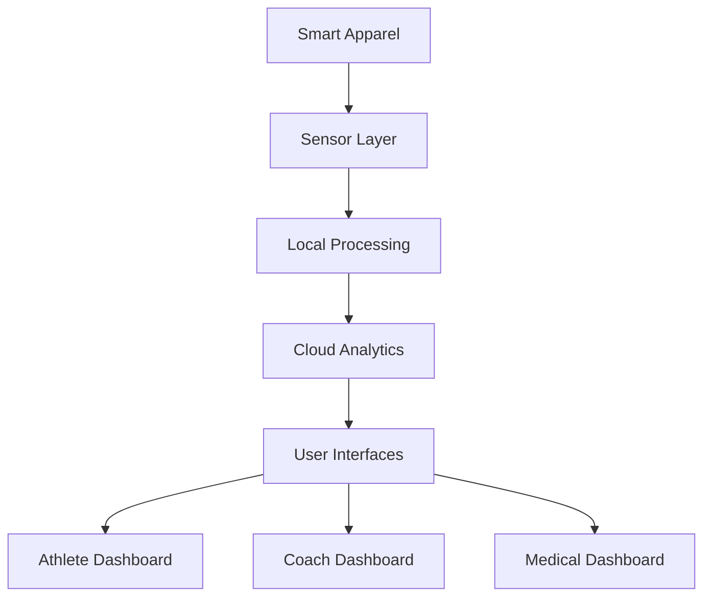
```mermaid
graph TD
    A[Smart Apparel] --> B[Sensor Layer]
    B --> C[Local Processing]
    C --> D[Cloud Analytics]
    D --> E[User Interfaces]
    E --> F[Athlete Dashboard]
    E --> G[Coach Dashboard]
    E --> H[Medical Dashboard]
```

### Success Criteria

| Category | Metric | Target |
|----------|--------|--------|
| Accuracy | Sensor measurement precision | ±1% deviation |
| Performance | Real-time data processing | <100ms latency |
| Adoption | User engagement | >80% daily active users |
| Clinical | Injury prediction accuracy | >85% sensitivity |
| Technical | System uptime | 99.9% availability |

## 1.3 SCOPE

### In-Scope Elements

#### Core Features and Functionalities
- Real-time muscle activity monitoring and analysis
- Kinematic data capture and processing
- Statistical anomaly detection
- Heat map visualization
- Baseline movement pattern establishment
- Team-wide performance analytics
- Data sharing with authorized personnel
- Alert system for anomaly detection

#### Implementation Boundaries
| Boundary Type | Coverage |
|--------------|----------|
| User Groups | Athletes, Coaches, Medical Staff, System Administrators |
| Geographic | North American market initially |
| Device Support | iOS 14+, Android 10+, Modern web browsers |
| Data Storage | 5-year historical data retention |

### Out-of-Scope Elements
- Genetic analysis and recommendations
- Nutrition tracking and planning
- Equipment performance monitoring
- Non-athletic medical diagnostics
- Virtual coaching capabilities
- Social networking features
- Third-party device integration
- Remote training program management

# 2. SYSTEM ARCHITECTURE

## 2.1 High-Level Architecture

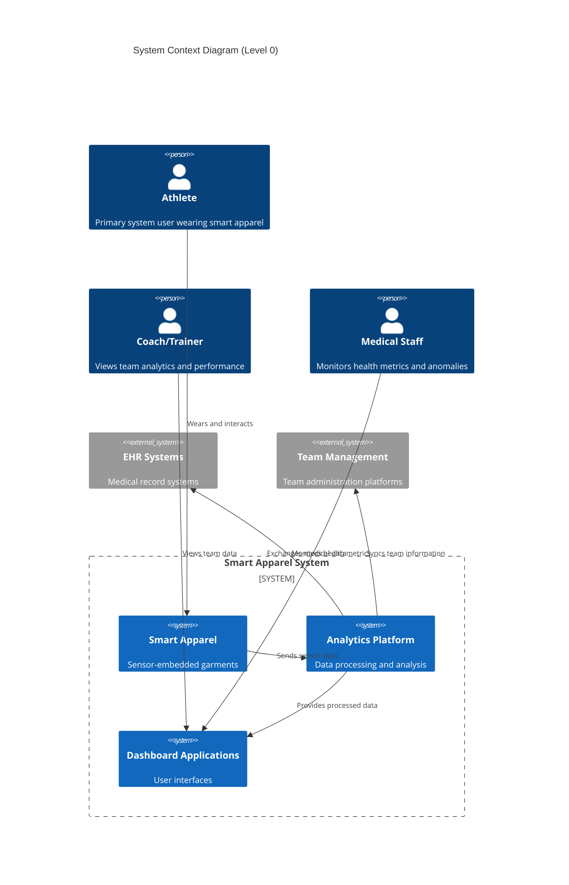
```mermaid
C4Context
    title System Context Diagram (Level 0)
    
    Person(athlete, "Athlete", "Primary system user wearing smart apparel")
    Person(coach, "Coach/Trainer", "Views team analytics and performance")
    Person(medical, "Medical Staff", "Monitors health metrics and anomalies")
    
    System_Boundary(system, "Smart Apparel System") {
        System(apparel, "Smart Apparel", "Sensor-embedded garments")
        System(analytics, "Analytics Platform", "Data processing and analysis")
        System(dashboard, "Dashboard Applications", "User interfaces")
    }
    
    System_Ext(ehr, "EHR Systems", "Medical record systems")
    System_Ext(team, "Team Management", "Team administration platforms")
    
    Rel(athlete, apparel, "Wears and interacts")
    Rel(apparel, analytics, "Sends sensor data")
    Rel(analytics, dashboard, "Provides processed data")
    Rel(coach, dashboard, "Views team data")
    Rel(medical, dashboard, "Monitors health metrics")
    Rel(analytics, ehr, "Exchanges medical data")
    Rel(analytics, team, "Syncs team information")
```

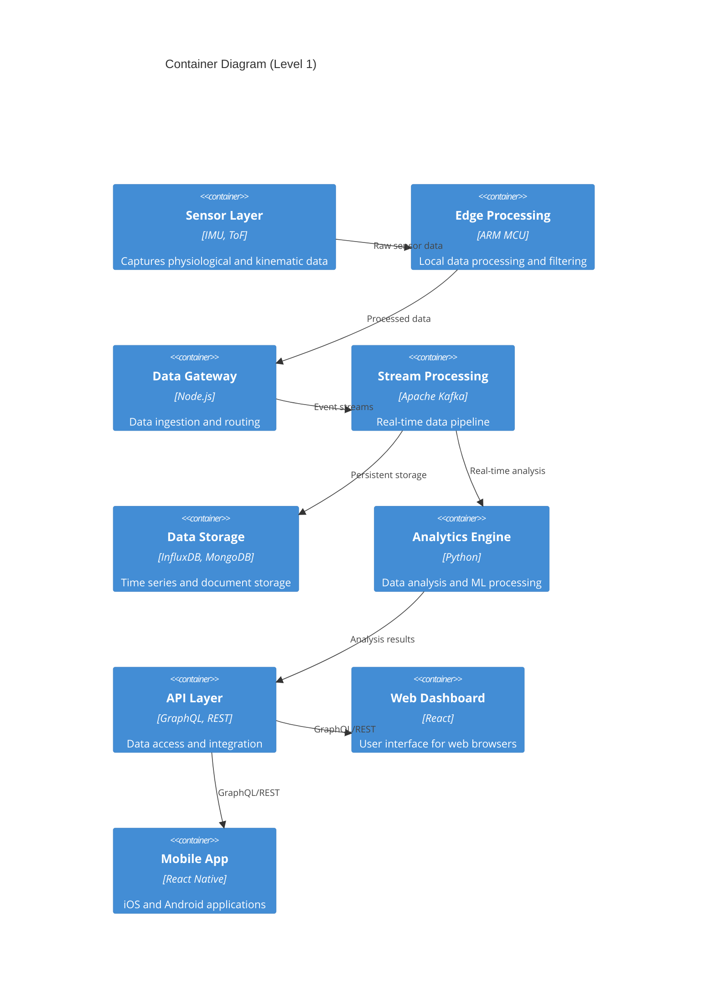
```mermaid
C4Container
    title Container Diagram (Level 1)
    
    Container(sensors, "Sensor Layer", "IMU, ToF", "Captures physiological and kinematic data")
    Container(edge, "Edge Processing", "ARM MCU", "Local data processing and filtering")
    Container(gateway, "Data Gateway", "Node.js", "Data ingestion and routing")
    Container(stream, "Stream Processing", "Apache Kafka", "Real-time data pipeline")
    Container(storage, "Data Storage", "InfluxDB, MongoDB", "Time series and document storage")
    Container(compute, "Analytics Engine", "Python", "Data analysis and ML processing")
    Container(api, "API Layer", "GraphQL, REST", "Data access and integration")
    Container(web, "Web Dashboard", "React", "User interface for web browsers")
    Container(mobile, "Mobile App", "React Native", "iOS and Android applications")
    
    Rel(sensors, edge, "Raw sensor data")
    Rel(edge, gateway, "Processed data")
    Rel(gateway, stream, "Event streams")
    Rel(stream, storage, "Persistent storage")
    Rel(stream, compute, "Real-time analysis")
    Rel(compute, api, "Analysis results")
    Rel(api, web, "GraphQL/REST")
    Rel(api, mobile, "GraphQL/REST")
```

## 2.2 Component Details

### 2.2.1 Sensor Layer
- **Purpose**: Data acquisition from wearable sensors
- **Technologies**: 
  - Infrared Time-of-Flight sensors (100Hz sampling)
  - IMU sensors (200Hz sampling)
  - Bluetooth 5.0 LE communication
- **Data Requirements**: 
  - Local buffering: 1GB flash storage
  - Data compression: 10:1 ratio
  - Battery life optimization

### 2.2.2 Edge Processing
- **Purpose**: Local data filtering and preprocessing
- **Technologies**:
  - ARM Cortex-M4F microcontroller
  - FreeRTOS real-time operating system
  - Custom signal processing algorithms
- **Interfaces**:
  - SPI/I2C sensor interfaces
  - BLE stack for data transmission
  - Firmware update channel

### 2.2.3 Cloud Platform
- **Purpose**: Core data processing and storage
- **Technologies**:
  - Kubernetes for container orchestration
  - Apache Kafka for event streaming
  - InfluxDB for time series data
  - MongoDB for document storage
- **Scaling**:
  - Horizontal scaling up to 100k concurrent users
  - Auto-scaling based on load metrics
  - Multi-region deployment

## 2.3 Technical Decisions

### 2.3.1 Architecture Style
| Aspect | Choice | Justification |
|--------|--------|---------------|
| Pattern | Microservices | Enables independent scaling and deployment |
| Communication | Event-driven | Handles real-time data streams efficiently |
| API Design | GraphQL + REST | Flexible data queries and standard integration |
| Storage | Polyglot Persistence | Optimized for different data types |

### 2.3.2 Data Flow Architecture

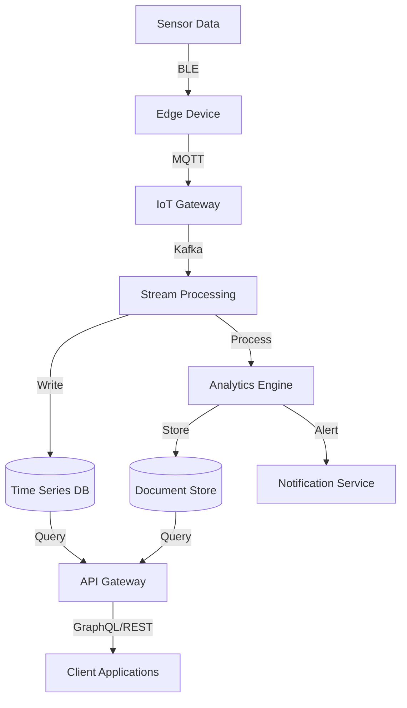
```mermaid
flowchart TD
    A[Sensor Data] -->|BLE| B[Edge Device]
    B -->|MQTT| C[IoT Gateway]
    C -->|Kafka| D[Stream Processing]
    D -->|Write| E[(Time Series DB)]
    D -->|Process| F[Analytics Engine]
    F -->|Store| G[(Document Store)]
    F -->|Alert| H[Notification Service]
    E -->|Query| I[API Gateway]
    G -->|Query| I
    I -->|GraphQL/REST| J[Client Applications]
```

## 2.4 Cross-Cutting Concerns

### 2.4.1 Monitoring and Observability

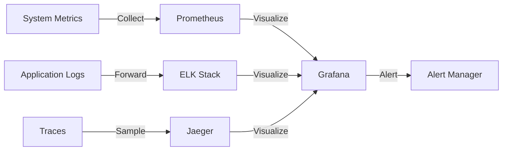
```mermaid
flowchart LR
    A[System Metrics] -->|Collect| B[Prometheus]
    C[Application Logs] -->|Forward| D[ELK Stack]
    E[Traces] -->|Sample| F[Jaeger]
    B & D & F -->|Visualize| G[Grafana]
    G -->|Alert| H[Alert Manager]
```

### 2.4.2 Security Architecture

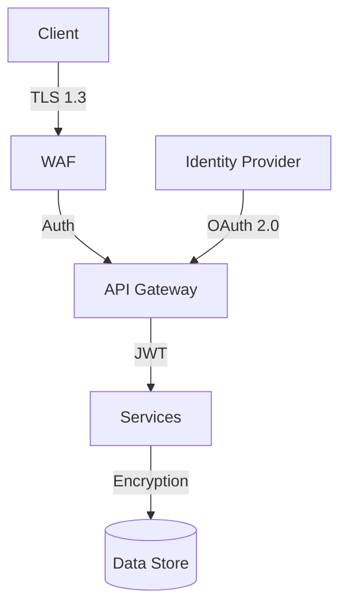
```mermaid
flowchart TD
    A[Client] -->|TLS 1.3| B[WAF]
    B -->|Auth| C[API Gateway]
    C -->|JWT| D[Services]
    D -->|Encryption| E[(Data Store)]
    F[Identity Provider] -->|OAuth 2.0| C
```

## 2.5 Deployment Architecture

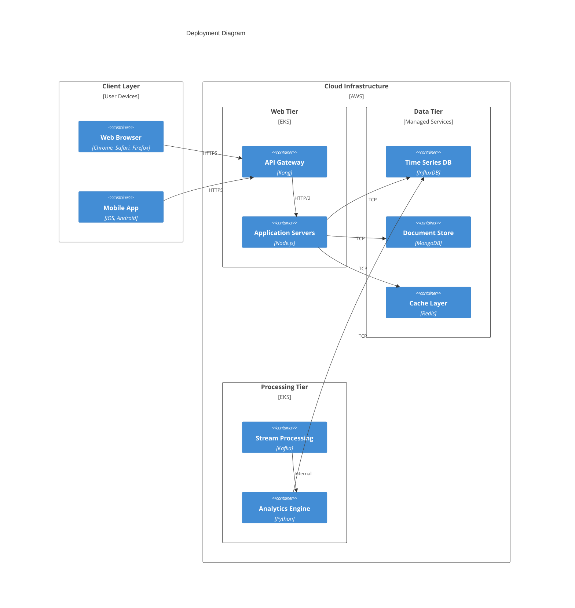
```mermaid
C4Deployment
    title Deployment Diagram
    
    Deployment_Node(client, "Client Layer", "User Devices") {
        Container(browser, "Web Browser", "Chrome, Safari, Firefox")
        Container(mobile_app, "Mobile App", "iOS, Android")
    }
    
    Deployment_Node(cloud, "Cloud Infrastructure", "AWS") {
        Deployment_Node(web, "Web Tier", "EKS") {
            Container(api_gateway, "API Gateway", "Kong")
            Container(app_servers, "Application Servers", "Node.js")
        }
        
        Deployment_Node(data, "Data Tier", "Managed Services") {
            Container(ts_db, "Time Series DB", "InfluxDB")
            Container(doc_db, "Document Store", "MongoDB")
            Container(cache, "Cache Layer", "Redis")
        }
        
        Deployment_Node(processing, "Processing Tier", "EKS") {
            Container(stream_proc, "Stream Processing", "Kafka")
            Container(analytics, "Analytics Engine", "Python")
        }
    }
    
    Rel(browser, api_gateway, "HTTPS")
    Rel(mobile_app, api_gateway, "HTTPS")
    Rel(api_gateway, app_servers, "HTTP/2")
    Rel(app_servers, ts_db, "TCP")
    Rel(app_servers, doc_db, "TCP")
    Rel(app_servers, cache, "TCP")
    Rel(stream_proc, analytics, "Internal")
    Rel(analytics, ts_db, "TCP")
```

# 3. SYSTEM COMPONENTS ARCHITECTURE

## 3.1 USER INTERFACE DESIGN

### 3.1.1 Design Specifications

| Category | Requirement | Details |
|----------|-------------|----------|
| Visual Hierarchy | Material Design 3.0 | Elevation system, dynamic color, typography scale |
| Component Library | Custom Design System | Based on Material Design tokens with sports-specific components |
| Responsive Design | Mobile-first | Breakpoints: 320px, 768px, 1024px, 1440px |
| Accessibility | WCAG 2.1 Level AA | Focus indicators, semantic HTML, ARIA labels |
| Device Support | Cross-platform | iOS 14+, Android 10+, Modern browsers |
| Theming | Dynamic | System-based dark/light mode, team color theming |
| i18n | Multi-language | English, Spanish, French initial support |

### 3.1.2 Interface Elements

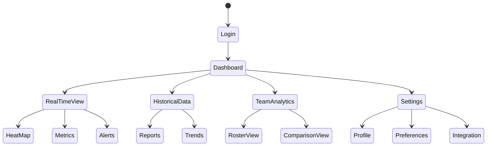
```mermaid
stateDiagram-v2
    [*] --> Login
    Login --> Dashboard
    Dashboard --> RealTimeView
    Dashboard --> HistoricalData
    Dashboard --> TeamAnalytics
    Dashboard --> Settings
    
    RealTimeView --> HeatMap
    RealTimeView --> Metrics
    RealTimeView --> Alerts
    
    HistoricalData --> Reports
    HistoricalData --> Trends
    
    TeamAnalytics --> RosterView
    TeamAnalytics --> ComparisonView
    
    Settings --> Profile
    Settings --> Preferences
    Settings --> Integration
```

### 3.1.3 Critical User Flows

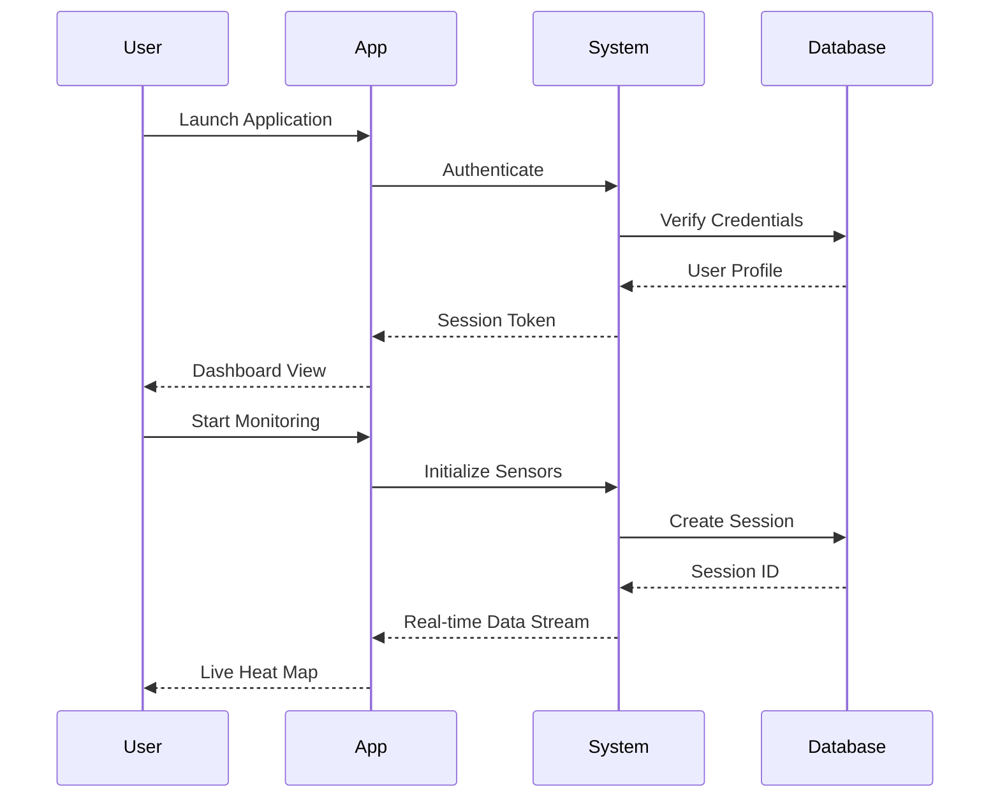
```mermaid
sequenceDiagram
    participant U as User
    participant A as App
    participant S as System
    participant D as Database

    U->>A: Launch Application
    A->>S: Authenticate
    S->>D: Verify Credentials
    D-->>S: User Profile
    S-->>A: Session Token
    A-->>U: Dashboard View
    
    U->>A: Start Monitoring
    A->>S: Initialize Sensors
    S->>D: Create Session
    D-->>S: Session ID
    S-->>A: Real-time Data Stream
    A-->>U: Live Heat Map
```

## 3.2 DATABASE DESIGN

### 3.2.1 Schema Design

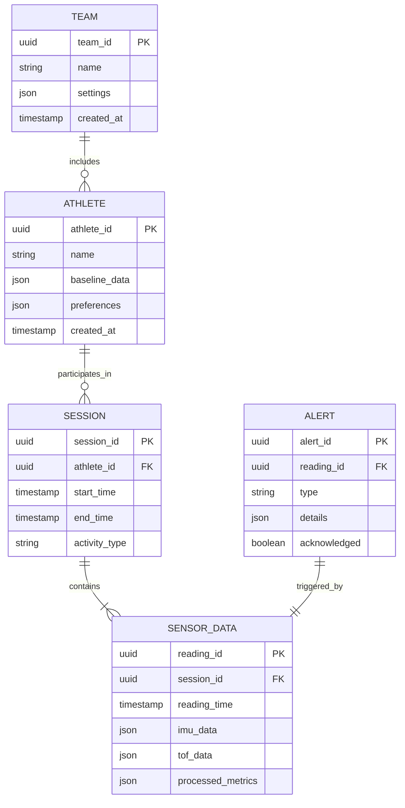
```mermaid
erDiagram
    ATHLETE ||--o{ SESSION : participates_in
    ATHLETE {
        uuid athlete_id PK
        string name
        json baseline_data
        json preferences
        timestamp created_at
    }
    SESSION ||--|{ SENSOR_DATA : contains
    SESSION {
        uuid session_id PK
        uuid athlete_id FK
        timestamp start_time
        timestamp end_time
        string activity_type
    }
    SENSOR_DATA {
        uuid reading_id PK
        uuid session_id FK
        timestamp reading_time
        json imu_data
        json tof_data
        json processed_metrics
    }
    TEAM ||--o{ ATHLETE : includes
    TEAM {
        uuid team_id PK
        string name
        json settings
        timestamp created_at
    }
    ALERT ||--|| SENSOR_DATA : triggered_by
    ALERT {
        uuid alert_id PK
        uuid reading_id FK
        string type
        json details
        boolean acknowledged
    }
```

### 3.2.2 Data Management Strategy

| Aspect | Strategy | Details |
|--------|----------|----------|
| Time Series Data | InfluxDB | Retention: 6 months hot, 5 years cold |
| Document Store | MongoDB | User profiles, team data, configurations |
| Cache Layer | Redis | Session data, real-time metrics |
| Backup Strategy | Continuous | 5-minute incremental, daily full backup |
| Data Privacy | Field-level | Encryption for PII, anonymization for analytics |
| Audit Logging | Comprehensive | All data access and modifications logged |

## 3.3 API DESIGN

### 3.3.1 API Architecture

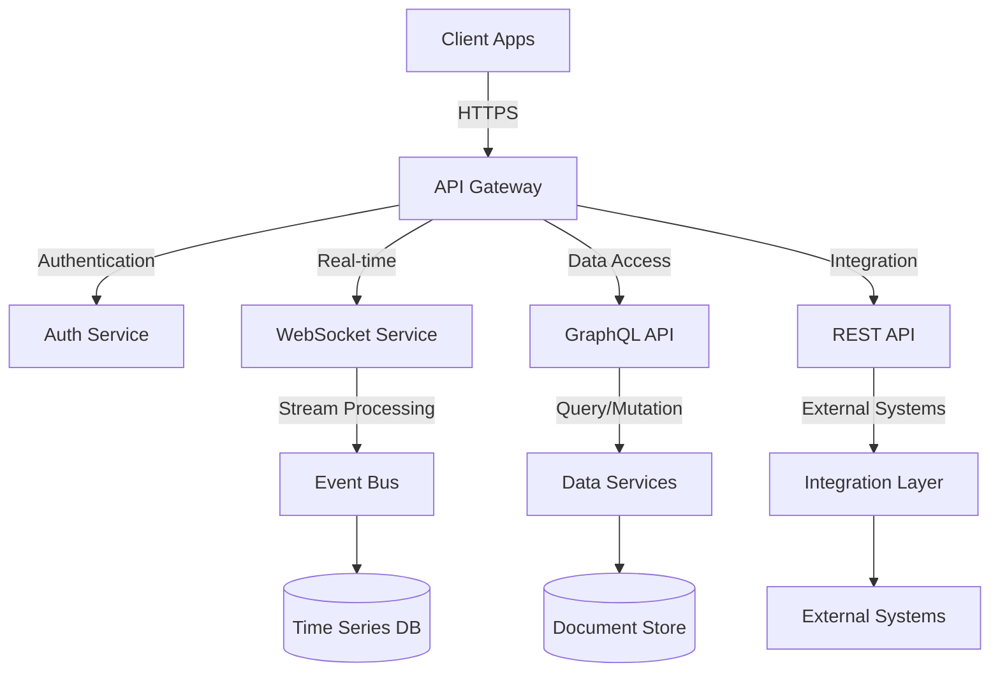
```mermaid
graph TD
    A[Client Apps] -->|HTTPS| B[API Gateway]
    B -->|Authentication| C[Auth Service]
    B -->|Real-time| D[WebSocket Service]
    B -->|Data Access| E[GraphQL API]
    B -->|Integration| F[REST API]
    
    D -->|Stream Processing| G[Event Bus]
    E -->|Query/Mutation| H[Data Services]
    F -->|External Systems| I[Integration Layer]
    
    G --> J[(Time Series DB)]
    H --> K[(Document Store)]
    I --> L[External Systems]
```

### 3.3.2 API Specifications

| Endpoint Type | Protocol | Authentication | Rate Limit |
|--------------|----------|----------------|------------|
| Real-time Data | WebSocket | JWT | 100 msg/sec |
| Query API | GraphQL | OAuth 2.0 | 1000 req/min |
| Integration API | REST | API Key | 500 req/min |
| Admin API | REST | MFA | 100 req/min |

### 3.3.3 Integration Patterns

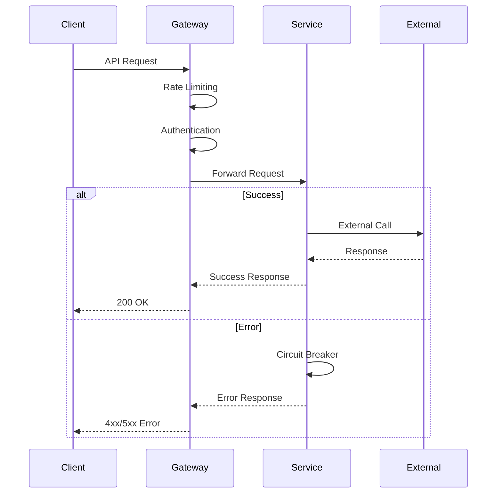
```mermaid
sequenceDiagram
    participant C as Client
    participant G as Gateway
    participant S as Service
    participant E as External

    C->>G: API Request
    G->>G: Rate Limiting
    G->>G: Authentication
    G->>S: Forward Request
    
    alt Success
        S->>E: External Call
        E-->>S: Response
        S-->>G: Success Response
        G-->>C: 200 OK
    else Error
        S->>S: Circuit Breaker
        S-->>G: Error Response
        G-->>C: 4xx/5xx Error
    end
```

# 4. TECHNOLOGY STACK

## 4.1 PROGRAMMING LANGUAGES

| Layer | Language | Version | Justification |
|-------|----------|---------|---------------|
| Sensor/Edge | C++ | 17 | Low-level hardware access, real-time processing capabilities |
| Backend Services | Python | 3.11+ | Strong data processing libraries, ML capabilities |
| Web Frontend | TypeScript | 5.0+ | Type safety, enhanced developer productivity |
| Mobile Apps | Swift/Kotlin | Swift 5.9, Kotlin 1.9 | Native performance, platform-specific features |
| Data Processing | Rust | 1.70+ | High-performance stream processing, memory safety |
| DevOps | Go | 1.21+ | Efficient tooling, cross-platform compatibility |

## 4.2 FRAMEWORKS & LIBRARIES

### Core Frameworks

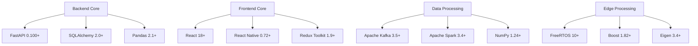
```mermaid
graph TD
    A[Backend Core] --> B[FastAPI 0.100+]
    A --> C[SQLAlchemy 2.0+]
    A --> D[Pandas 2.1+]
    
    E[Frontend Core] --> F[React 18+]
    E --> G[React Native 0.72+]
    E --> H[Redux Toolkit 1.9+]
    
    I[Data Processing] --> J[Apache Kafka 3.5+]
    I --> K[Apache Spark 3.4+]
    I --> L[NumPy 1.24+]
    
    M[Edge Processing] --> N[FreeRTOS 10+]
    M --> O[Boost 1.82+]
    M --> P[Eigen 3.4+]
```

### Supporting Libraries

| Category | Library | Version | Purpose |
|----------|---------|---------|----------|
| API | GraphQL | 16.8+ | Flexible data queries |
| Visualization | D3.js | 7.8+ | Real-time data visualization |
| ML | PyTorch | 2.0+ | Anomaly detection models |
| Testing | Jest/PyTest | 29+/7.4+ | Automated testing |
| Monitoring | OpenTelemetry | 1.0+ | Observability |

## 4.3 DATABASES & STORAGE

### Primary Databases

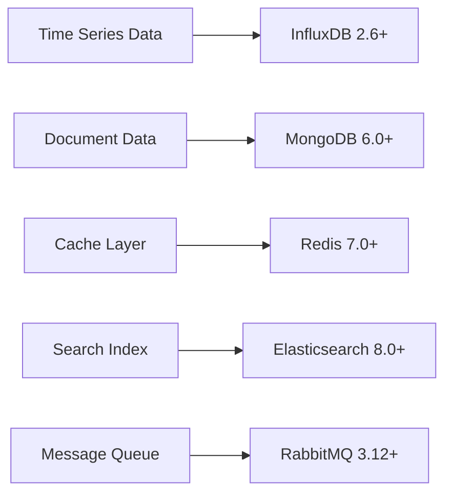
```mermaid
flowchart LR
    A[Time Series Data] --> B[InfluxDB 2.6+]
    C[Document Data] --> D[MongoDB 6.0+]
    E[Cache Layer] --> F[Redis 7.0+]
    G[Search Index] --> H[Elasticsearch 8.0+]
    I[Message Queue] --> J[RabbitMQ 3.12+]
```

### Storage Strategy

| Data Type | Storage Solution | Retention Policy |
|-----------|-----------------|------------------|
| Raw Sensor Data | InfluxDB | 7 days hot, 30 days warm |
| Processed Metrics | MongoDB | 6 months active |
| User Profiles | MongoDB | Indefinite |
| Analytics Data | S3 + Glacier | 5 years |
| Session Data | Redis | 24 hours |

## 4.4 THIRD-PARTY SERVICES

### Cloud Services (AWS)

| Service | Purpose | Configuration |
|---------|----------|--------------|
| EKS | Container Orchestration | Multi-AZ, Auto-scaling |
| S3 | Object Storage | Versioning enabled |
| CloudFront | CDN | Edge locations worldwide |
| RDS | Database Hosting | Multi-AZ, Read replicas |
| Lambda | Serverless Functions | Memory: 1-4GB |

### External Integrations

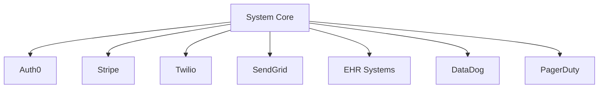
```mermaid
graph TD
    A[System Core] --> B[Auth0]
    A --> C[Stripe]
    A --> D[Twilio]
    A --> E[SendGrid]
    A --> F[EHR Systems]
    A --> G[DataDog]
    A --> H[PagerDuty]
```

## 4.5 DEVELOPMENT & DEPLOYMENT

### Development Environment

| Tool | Version | Purpose |
|------|---------|---------|
| Docker | 24+ | Containerization |
| Kubernetes | 1.27+ | Orchestration |
| Terraform | 1.5+ | Infrastructure as Code |
| GitLab CI | Latest | CI/CD Pipeline |

### Deployment Pipeline

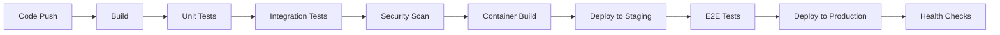
```mermaid
flowchart LR
    A[Code Push] --> B[Build]
    B --> C[Unit Tests]
    C --> D[Integration Tests]
    D --> E[Security Scan]
    E --> F[Container Build]
    F --> G[Deploy to Staging]
    G --> H[E2E Tests]
    H --> I[Deploy to Production]
    I --> J[Health Checks]
```

### Infrastructure Requirements

| Component | Specification | Scaling |
|-----------|--------------|----------|
| API Servers | t3.large | Auto-scale 2-10 |
| Workers | c6g.xlarge | Auto-scale 3-15 |
| Database | r6g.2xlarge | Multi-AZ |
| Cache | r6g.large | Cluster mode |
| Storage | io2 | 5000 IOPS |

# 5. SYSTEM DESIGN

## 5.1 USER INTERFACE DESIGN

### 5.1.1 Dashboard Layout

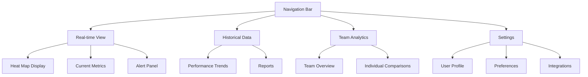
```mermaid
graph TD
    A[Navigation Bar] --> B[Real-time View]
    A --> C[Historical Data]
    A --> D[Team Analytics]
    A --> E[Settings]
    
    B --> F[Heat Map Display]
    B --> G[Current Metrics]
    B --> H[Alert Panel]
    
    C --> I[Performance Trends]
    C --> J[Reports]
    
    D --> K[Team Overview]
    D --> L[Individual Comparisons]
    
    E --> M[User Profile]
    E --> N[Preferences]
    E --> O[Integrations]
```

### 5.1.2 Component Specifications

| Component | Description | Interaction Pattern |
|-----------|-------------|-------------------|
| Heat Map Display | Real-time visualization of sensor data | Interactive zoom, pan, time-scrubbing |
| Metrics Panel | Current performance indicators | Auto-updating, expandable cards |
| Alert System | Anomaly notifications | Pop-up notifications, sound alerts |
| Team Dashboard | Multi-athlete overview | Sortable grid, filtering options |
| Historical View | Past performance analysis | Timeline navigation, data export |

### 5.1.3 Responsive Breakpoints

| Screen Size | Layout Adjustments | Component Behavior |
|-------------|-------------------|-------------------|
| Desktop (≥1200px) | Full dashboard view | All components visible |
| Tablet (≥768px) | Condensed navigation | Collapsible panels |
| Mobile (≥320px) | Single column layout | Stacked components |

## 5.2 DATABASE DESIGN

### 5.2.1 Data Model

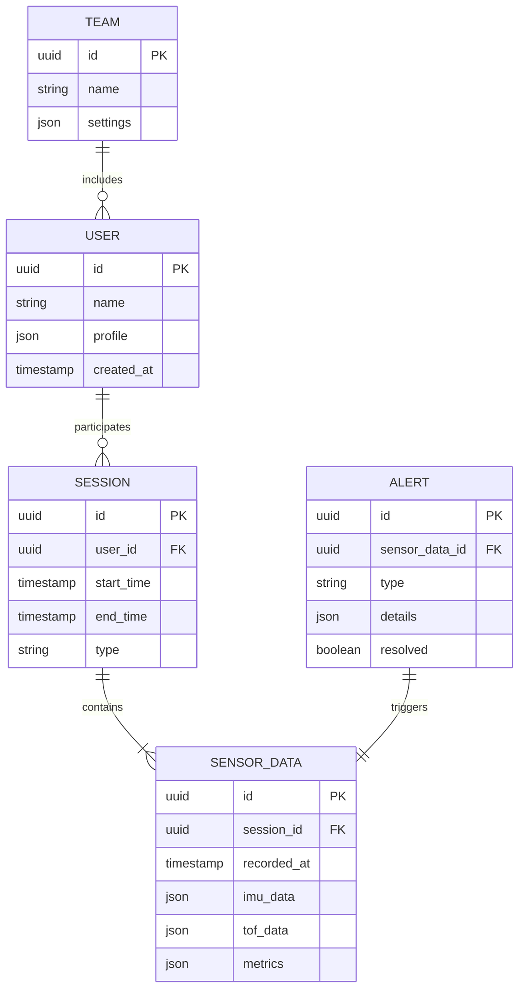
```mermaid
erDiagram
    USER ||--o{ SESSION : participates
    USER {
        uuid id PK
        string name
        json profile
        timestamp created_at
    }
    SESSION ||--|{ SENSOR_DATA : contains
    SESSION {
        uuid id PK
        uuid user_id FK
        timestamp start_time
        timestamp end_time
        string type
    }
    SENSOR_DATA {
        uuid id PK
        uuid session_id FK
        timestamp recorded_at
        json imu_data
        json tof_data
        json metrics
    }
    TEAM ||--o{ USER : includes
    TEAM {
        uuid id PK
        string name
        json settings
    }
    ALERT ||--|| SENSOR_DATA : triggers
    ALERT {
        uuid id PK
        uuid sensor_data_id FK
        string type
        json details
        boolean resolved
    }
```

### 5.2.2 Storage Strategy

| Data Type | Storage Solution | Retention Policy |
|-----------|-----------------|------------------|
| Real-time Metrics | InfluxDB | 7 days hot storage |
| User Profiles | MongoDB | Indefinite |
| Session Data | MongoDB | 6 months |
| Historical Data | S3 | 5 years |

## 5.3 API DESIGN

### 5.3.1 API Architecture

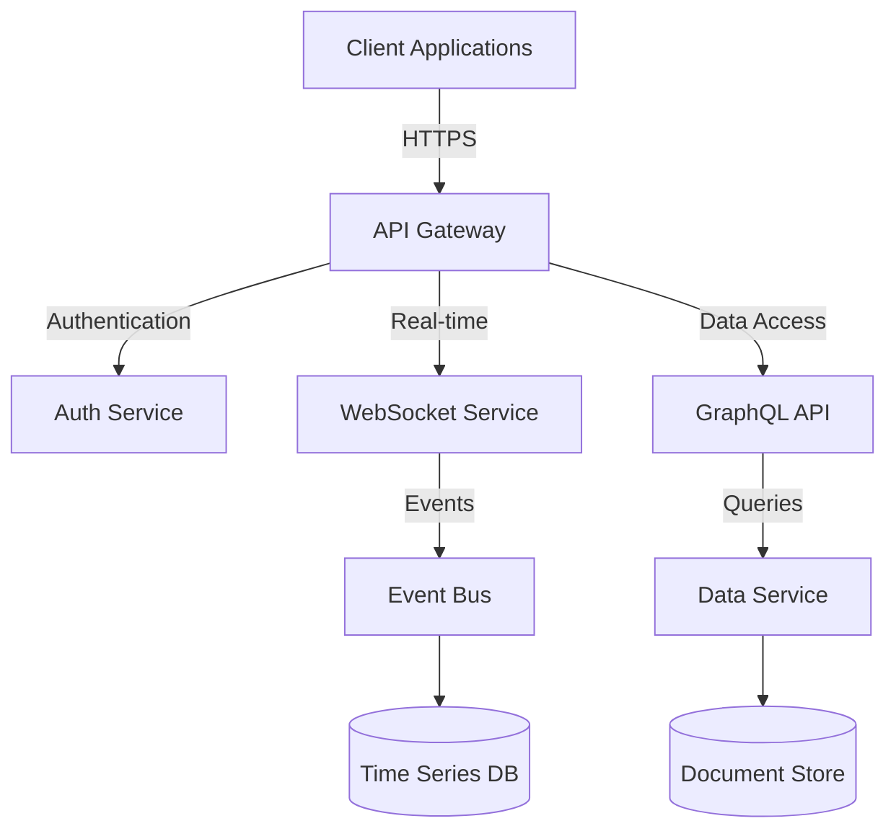
```mermaid
graph TD
    A[Client Applications] -->|HTTPS| B[API Gateway]
    B -->|Authentication| C[Auth Service]
    B -->|Real-time| D[WebSocket Service]
    B -->|Data Access| E[GraphQL API]
    
    D -->|Events| F[Event Bus]
    E -->|Queries| G[Data Service]
    
    F --> H[(Time Series DB)]
    G --> I[(Document Store)]
```

### 5.3.2 API Endpoints

| Endpoint | Method | Purpose | Authentication |
|----------|--------|---------|----------------|
| /api/v1/sessions | POST | Create new session | JWT |
| /api/v1/metrics | GET | Retrieve metrics | JWT |
| /api/v1/alerts | GET | Get active alerts | JWT |
| /ws/sensor-data | WebSocket | Real-time data | JWT + Socket Token |

### 5.3.3 Data Flow

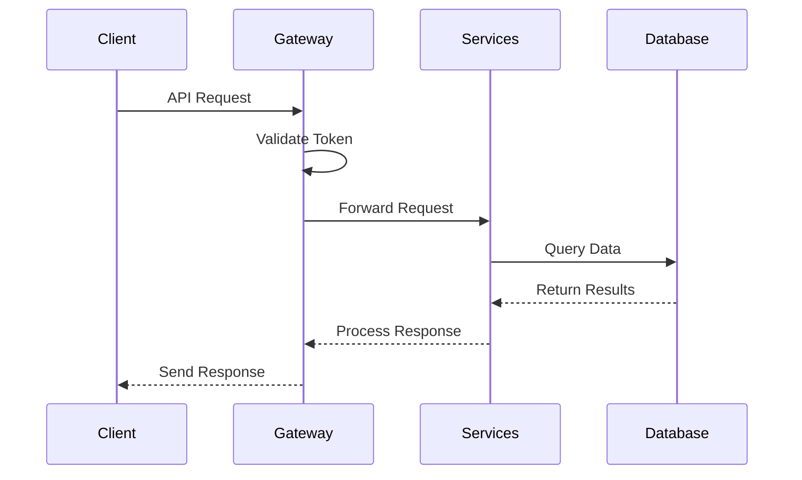
```mermaid
sequenceDiagram
    participant C as Client
    participant G as Gateway
    participant S as Services
    participant D as Database

    C->>G: API Request
    G->>G: Validate Token
    G->>S: Forward Request
    S->>D: Query Data
    D-->>S: Return Results
    S-->>G: Process Response
    G-->>C: Send Response
```

### 5.3.4 Integration Patterns

| Pattern | Implementation | Use Case |
|---------|---------------|----------|
| Event Sourcing | Kafka | Sensor data stream |
| CQRS | Separate read/write models | Performance optimization |
| Circuit Breaker | Hystrix | Fault tolerance |
| API Gateway | Kong | Request routing |

# 6. USER INTERFACE DESIGN

## 6.1 Common Elements

### Key/Legend
```
Icons:
[?] - Help/Information tooltip
[$] - Payment/Financial data
[i] - Information display
[+] - Add new item
[x] - Close/Delete
[<][>] - Navigation controls
[^] - Upload data
[#] - Dashboard menu
[@] - User profile
[!] - Alert/Warning
[=] - Settings menu
[*] - Important/Favorite

Interactive Elements:
[ ] - Checkbox
( ) - Radio button
[Button] - Clickable button
[...] - Text input field
[====] - Progress indicator
[v] - Dropdown menu
```

## 6.2 Main Dashboard Layout

```
+----------------------------------------------------------+
|  [@] User Name    [#] Dashboard    [!] Alerts    [=] Menu |
+----------------------------------------------------------+
|                                                          |
|  +------------------+  +---------------------------+     |
|  |  Athlete Stats   |  |      Real-time View      |     |
|  |  [====] 85%      |  |                         |     |
|  |  Performance     |  |    [Heat Map Display]    |     |
|  +------------------+  |                         |     |
|                       +---------------------------+     |
|                                                          |
|  +------------------+  +---------------------------+     |
|  |   Quick Actions  |  |    Performance Metrics   |     |
|  | [+] New Session  |  | [*] Peak Force: 850N     |     |
|  | [^] Upload Data  |  | [*] Balance: 48L/52R     |     |
|  +------------------+  +---------------------------+     |
|                                                          |
+----------------------------------------------------------+
```

## 6.3 Heat Map View

```
+----------------------------------------------------------+
|  [<] Back    Current Session    [?] Help                  |
+----------------------------------------------------------+
|                                                          |
|  +------------------------+  +----------------------+     |
|  |    Muscle Activity    |  |    Control Panel     |     |
|  |                      |  | Sensitivity: [v]      |     |
|  |    [Color Gradient]   |  | View Mode: ( )2D     |     |
|  |                      |  |           (*)3D     |     |
|  |                      |  | [Capture Screenshot]  |     |
|  +------------------------+  +----------------------+     |
|                                                          |
|  +------------------------------------------------+     |
|  |                 Timeline Control                |     |
|  |  [<] [===================================] [>] |     |
|  |  00:00                                   05:30 |     |
|  +------------------------------------------------+     |
|                                                          |
+----------------------------------------------------------+
```

## 6.4 Alert Interface

```
+----------------------------------------------------------+
|                      Active Alerts                         |
+----------------------------------------------------------+
|                                                          |
|  [!] High Impact Detection                               |
|  +--------------------------------------------------+   |
|  | Location: Right Knee                              |   |
|  | Severity: High                                    |   |
|  | Time: 14:23:45                                   |   |
|  | [View Details] [Dismiss] [Share with Trainer]     |   |
|  +--------------------------------------------------+   |
|                                                          |
|  [!] Muscle Imbalance Warning                           |
|  +--------------------------------------------------+   |
|  | Area: Quadriceps                                  |   |
|  | Difference: 15%                                   |   |
|  | Duration: 5 minutes                               |   |
|  | [View Details] [Dismiss] [Share with Trainer]     |   |
|  +--------------------------------------------------+   |
|                                                          |
+----------------------------------------------------------+
```

## 6.5 Data Sharing Panel

```
+----------------------------------------------------------+
|                    Share Session Data                      |
+----------------------------------------------------------+
|                                                          |
|  Select Recipients:                                      |
|  [ ] Head Coach - John Smith                            |
|  [x] Team Trainer - Sarah Johnson                       |
|  [ ] Physical Therapist - Dr. Brown                     |
|                                                          |
|  Share Options:                                          |
|  (*) Full Session Data                                  |
|  ( ) Summary Only                                       |
|  ( ) Specific Metrics                                   |
|                                                          |
|  Additional Notes:                                       |
|  +--------------------------------------------------+   |
|  |                                                  |   |
|  | [......................................]         |   |
|  |                                                  |   |
|  +--------------------------------------------------+   |
|                                                          |
|  [Cancel]                     [Share Data]              |
|                                                          |
+----------------------------------------------------------+
```

## 6.6 Settings Interface

```
+----------------------------------------------------------+
|                     System Settings                        |
+----------------------------------------------------------+
|                                                          |
|  Profile Settings:                                       |
|  +--------------------------------------------------+   |
|  | [@] Profile Picture [^]                          |   |
|  | Name: [...........................]              |   |
|  | Team: [v] Select Team                            |   |
|  | Role: [v] Select Role                            |   |
|  +--------------------------------------------------+   |
|                                                          |
|  Notification Preferences:                               |
|  +--------------------------------------------------+   |
|  | [x] High Impact Alerts                           |   |
|  | [ ] Performance Updates                          |   |
|  | [x] Team Messages                               |   |
|  | Notification Method: (*)App ( )Email ( )Both     |   |
|  +--------------------------------------------------+   |
|                                                          |
|  [Save Changes]                [Reset to Default]        |
|                                                          |
+----------------------------------------------------------+
```

## 6.7 Mobile Responsive Layouts

### Mobile Dashboard
```
+----------------------+
| [@] [#] [!] [=]     |
+----------------------+
| Performance Summary  |
| [====] 85%          |
+----------------------+
| Quick Actions        |
| [+] New [^] Upload  |
+----------------------+
| Heat Map            |
| [Swipe for more >]  |
+----------------------+
| Recent Alerts       |
| [!] Impact Warning  |
| [!] Balance Alert   |
+----------------------+
```

### Mobile Heat Map
```
+----------------------+
| [<] Heat Map    [?] |
+----------------------+
| View: [v]           |
+----------------------+
|                    |
|   [Heat Map        |
|    Display]        |
|                    |
+----------------------+
| Timeline            |
| [<] [====] [>]     |
| 00:00    02:30     |
+----------------------+
```

# 7. SECURITY CONSIDERATIONS

## 7.1 AUTHENTICATION AND AUTHORIZATION

### 7.1.1 Authentication Methods

| User Type | Primary Authentication | Secondary Authentication | Session Duration |
|-----------|----------------------|-------------------------|------------------|
| Athletes | Biometric/OAuth 2.0 | Push notification | 24 hours |
| Coaches | Username/Password | TOTP (Google Auth) | 12 hours |
| Medical Staff | SAML SSO | Hardware key (FIDO2) | 8 hours |
| System Admins | Certificate-based | YubiKey | 4 hours |

### 7.1.2 Authorization Model

```mermaid
graph TD
    A[User Login] --> B{Role Check}
    B -->|Athlete| C[Personal Data Access]
    B -->|Coach| D[Team Data Access]
    B -->|Medical| E[Clinical Data Access]
    B -->|Admin| F[System Access]
    
    C --> G[View Own Data]
    C --> H[Share Data]
    
    D --> I[View Team Data]
    D --> J[Manage Athletes]
    
    E --> K[View Medical Data]
    E --> L[Create Treatment Plans]
    
    F --> M[Full System Access]
    F --> N[User Management]
```

## 7.2 DATA SECURITY

### 7.2.1 Encryption Standards

| Data State | Encryption Method | Key Length | Rotation Period |
|------------|------------------|------------|-----------------|
| At Rest | AES-256-GCM | 256-bit | 90 days |
| In Transit | TLS 1.3 | 256-bit | Per session |
| Backup | AES-256-CBC | 256-bit | 30 days |
| Database | Field-level AES | 256-bit | 180 days |

### 7.2.2 Data Classification and Protection

```mermaid
flowchart LR
    A[Raw Data] --> B{Classification}
    B -->|PII| C[Encryption + Masking]
    B -->|Medical| D[HIPAA Controls]
    B -->|Performance| E[Role-Based Access]
    B -->|System| F[Audit Logging]
    
    C --> G[Secure Storage]
    D --> G
    E --> G
    F --> G
```

## 7.3 SECURITY PROTOCOLS

### 7.3.1 Network Security

| Layer | Protection Measure | Implementation |
|-------|-------------------|----------------|
| Edge | Firewall | AWS WAF |
| Transport | TLS 1.3 | Let's Encrypt |
| API | Rate Limiting | Kong Gateway |
| Database | Network Isolation | AWS VPC |
| Application | CORS Policy | Strict Origin |

### 7.3.2 Monitoring and Response

```mermaid
sequenceDiagram
    participant S as System
    participant M as Monitor
    participant A as Alert
    participant R as Response
    
    S->>M: Security Event
    M->>M: Event Analysis
    
    alt Threat Detected
        M->>A: Trigger Alert
        A->>R: Initiate Response
        R->>S: Apply Mitigation
    else Normal Activity
        M->>S: Continue Monitoring
    end
```

### 7.3.3 Compliance Controls

| Requirement | Control | Verification Method |
|-------------|---------|-------------------|
| HIPAA | PHI Encryption | Quarterly Audit |
| GDPR | Data Privacy | Annual Assessment |
| SOC 2 | Access Control | Monthly Review |
| FDA | Device Security | Continuous Monitoring |

### 7.3.4 Security Update Management

```mermaid
graph TD
    A[Security Update Available] --> B{Risk Assessment}
    B -->|Critical| C[Emergency Deployment]
    B -->|High| D[Next Maintenance Window]
    B -->|Medium| E[Scheduled Update]
    B -->|Low| F[Version Bundle]
    
    C --> G[Deploy]
    D --> G
    E --> G
    F --> G
    
    G --> H[Validation]
    H --> I[Security Review]
```

### 7.3.5 Incident Response Plan

| Phase | Actions | Responsible Team |
|-------|---------|-----------------|
| Detection | Log Analysis, Alert Verification | Security Operations |
| Containment | System Isolation, Traffic Filtering | Infrastructure Team |
| Eradication | Patch Application, Threat Removal | Security Engineering |
| Recovery | Service Restoration, Data Validation | Operations Team |
| Lessons Learned | Incident Analysis, Policy Updates | Security Management |

# 8. INFRASTRUCTURE

## 8.1 DEPLOYMENT ENVIRONMENT

### 8.1.1 Environment Strategy

| Environment | Purpose | Infrastructure | Scaling |
|-------------|---------|----------------|----------|
| Development | Feature development, unit testing | AWS (us-east-1) | t3.medium instances |
| Staging | Integration testing, UAT | AWS (us-east-1) | Mirror of production at 10% |
| Production | Live system | AWS (Multi-region) | Auto-scaling groups |
| DR Site | Business continuity | AWS (us-west-2) | Warm standby |

### 8.1.2 Regional Distribution

```mermaid
graph TB
    subgraph Primary [Primary Region us-east-1]
        A[Load Balancer] --> B[Application Tier]
        B --> C[Data Tier]
        B --> D[Processing Tier]
    end
    
    subgraph Secondary [Secondary Region us-west-2]
        E[Load Balancer] --> F[Application Tier]
        F --> G[Data Tier]
        F --> H[Processing Tier]
    end
    
    subgraph Edge [Edge Locations]
        I[CloudFront] --> J[Edge Processing]
    end
    
    I --> A
    I --> E
```

## 8.2 CLOUD SERVICES

### 8.2.1 AWS Service Configuration

| Service | Purpose | Configuration | Redundancy |
|---------|---------|---------------|------------|
| EKS | Container orchestration | 1.27+ | Multi-AZ |
| RDS | Relational database | Multi-AZ MySQL 8.0 | Active-passive |
| ElastiCache | Session/cache storage | Redis 7.0 cluster | Multi-AZ |
| S3 | Object storage | Standard + Glacier | Cross-region |
| CloudFront | CDN | Global edge locations | n+1 redundancy |
| Route53 | DNS management | Active-active | Global |
| DynamoDB | NoSQL database | Global tables | Multi-region |

### 8.2.2 Service Architecture

```mermaid
graph TD
    A[Route53] --> B[CloudFront]
    B --> C[ALB]
    C --> D[EKS Cluster]
    D --> E[EC2 Auto-Scaling Group]
    D --> F[RDS Multi-AZ]
    D --> G[ElastiCache]
    D --> H[S3]
    F --> I[S3 Backup]
    D --> J[DynamoDB]
    J --> K[DynamoDB Global Tables]
```

## 8.3 CONTAINERIZATION

### 8.3.1 Container Strategy

| Component | Base Image | Size | Security Scanning |
|-----------|------------|------|------------------|
| API Services | node:18-alpine | <200MB | Snyk |
| Processing Workers | python:3.11-slim | <500MB | Trivy |
| Frontend | nginx:alpine | <100MB | Clair |
| Database Tools | postgres:15-alpine | <200MB | Aqua |

### 8.3.2 Container Architecture

```mermaid
graph TD
    subgraph Container Registry
        A[ECR] --> B[Container Images]
    end
    
    subgraph EKS Cluster
        C[API Pods] --> D[Service Mesh]
        E[Worker Pods] --> D
        F[Frontend Pods] --> D
    end
    
    B --> C
    B --> E
    B --> F
```

## 8.4 ORCHESTRATION

### 8.4.1 Kubernetes Configuration

| Resource | Configuration | Scaling Policy |
|----------|--------------|----------------|
| API Deployment | CPU: 1, Memory: 2Gi | HPA 2-10 pods |
| Worker Deployment | CPU: 2, Memory: 4Gi | HPA 3-15 pods |
| Frontend Deployment | CPU: 0.5, Memory: 1Gi | HPA 2-8 pods |
| Ingress Controller | CPU: 2, Memory: 4Gi | Fixed 2 pods |

### 8.4.2 Cluster Architecture

```mermaid
graph TD
    subgraph EKS Control Plane
        A[API Server] --> B[etcd]
        A --> C[Controller Manager]
        A --> D[Scheduler]
    end
    
    subgraph Node Pool
        E[Node Group 1] --> F[System Pods]
        E --> G[Application Pods]
        H[Node Group 2] --> I[Worker Pods]
        H --> J[Monitoring Pods]
    end
    
    A --> E
    A --> H
```

## 8.5 CI/CD PIPELINE

### 8.5.1 Pipeline Stages

```mermaid
graph LR
    A[Code Push] --> B[Build]
    B --> C[Unit Tests]
    C --> D[Static Analysis]
    D --> E[Container Build]
    E --> F[Security Scan]
    F --> G[Deploy to Dev]
    G --> H[Integration Tests]
    H --> I[Deploy to Staging]
    I --> J[E2E Tests]
    J --> K[Deploy to Prod]
    K --> L[Health Check]
```

### 8.5.2 Pipeline Configuration

| Stage | Tool | SLA | Automation |
|-------|------|-----|------------|
| Source Control | GitLab | < 1 min | Branch protection |
| Build | GitLab CI | < 5 min | Auto-triggered |
| Testing | Jest/PyTest | < 10 min | Coverage > 80% |
| Security | SonarQube | < 5 min | Break on High |
| Deployment | ArgoCD | < 15 min | Progressive delivery |
| Monitoring | Datadog | Real-time | Auto-rollback |

### 8.5.3 Deployment Strategy

```mermaid
graph TD
    subgraph Production
        A[Blue Environment] 
        B[Green Environment]
        C[Load Balancer]
    end
    
    D[ArgoCD] --> E{Health Check}
    E -->|Pass| F[Traffic Shift]
    E -->|Fail| G[Rollback]
    
    F --> C
    C --> A
    C --> B
```

# APPENDICES

## A.1 ADDITIONAL TECHNICAL INFORMATION

### A.1.1 Sensor Calibration Parameters

| Parameter | Range | Default | Description |
|-----------|-------|---------|-------------|
| ToF Gain | 1-16 | 8 | Infrared sensor sensitivity |
| IMU Drift Correction | 0.1-2.0° | 0.5° | Gyroscope drift compensation |
| Pressure Threshold | 0.1-5.0 kg | 1.0 kg | Minimum detectable force |
| Sample Window | 50-500ms | 100ms | Data aggregation period |
| Filter Cutoff | 0.5-10 Hz | 2 Hz | Low-pass filter frequency |

### A.1.2 Data Processing Pipeline

```mermaid
flowchart TD
    A[Raw Sensor Data] --> B[Edge Filtering]
    B --> C[Compression]
    C --> D[Transmission]
    D --> E[Cloud Ingestion]
    E --> F{Data Type}
    F -->|Time Series| G[InfluxDB]
    F -->|Metadata| H[MongoDB]
    G --> I[Analytics Engine]
    H --> I
    I --> J[Dashboard Updates]
    I --> K[Alert Generation]
```

## A.2 GLOSSARY

| Term | Definition |
|------|------------|
| Anomaly Detection | Process of identifying data points that deviate significantly from established patterns |
| Baseline Model | Initial calibration data set used as a reference for future measurements |
| Edge Processing | Data computation performed on local hardware before cloud transmission |
| Force Plate | Sensor array measuring ground reaction forces during movement |
| Gait Analysis | Study of human locomotion patterns and characteristics |
| Heat Map | Visual representation of data using color intensity |
| Kinematic Chain | Series of connected joints and segments in human movement |
| Load Distribution | Pattern of force application across different body segments |
| Muscle Activation | Electrical activity in muscles during contraction |
| Range of Motion | Maximum movement potential of a joint |
| Soft Tissue Dynamics | Behavior and properties of non-rigid body tissues |
| Temporal Resolution | Precision of time-based measurements |

## A.3 ACRONYMS

| Acronym | Full Form |
|---------|-----------|
| ADC | Analog-to-Digital Converter |
| API | Application Programming Interface |
| BLE | Bluetooth Low Energy |
| CRUD | Create, Read, Update, Delete |
| DMA | Direct Memory Access |
| EMG | Electromyography |
| FHIR | Fast Healthcare Interoperability Resources |
| GPIO | General Purpose Input/Output |
| HRV | Heart Rate Variability |
| I2C | Inter-Integrated Circuit |
| IMU | Inertial Measurement Unit |
| IoT | Internet of Things |
| JWT | JSON Web Token |
| MCU | Microcontroller Unit |
| MQTT | Message Queuing Telemetry Transport |
| OTA | Over-the-Air |
| PCB | Printed Circuit Board |
| PWM | Pulse Width Modulation |
| RTOS | Real-Time Operating System |
| SDK | Software Development Kit |
| SPI | Serial Peripheral Interface |
| ToF | Time of Flight |
| UART | Universal Asynchronous Receiver/Transmitter |
| UUID | Universally Unique Identifier |
| WCAG | Web Content Accessibility Guidelines |

## A.4 SYSTEM STATUS CODES

| Code Range | Category | Description |
|------------|----------|-------------|
| 1000-1099 | Sensor Status | Hardware-level sensor conditions |
| 1100-1199 | Data Collection | Data acquisition and buffering states |
| 1200-1299 | Processing | Data processing and analysis status |
| 1300-1399 | Communication | Network and data transmission states |
| 1400-1499 | Storage | Database and persistence conditions |
| 1500-1599 | Application | Dashboard and UI-related states |
| 1600-1699 | Integration | Third-party system connection status |
| 1700-1799 | Security | Authentication and authorization states |