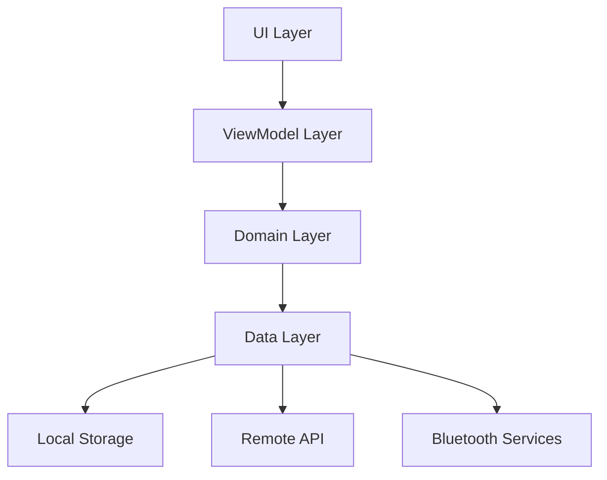

# Smart Apparel Android Application

Enterprise-grade Android application for real-time athletic performance monitoring with advanced sensor integration and analytics capabilities.

## Requirements

- Android Studio Arctic Fox or newer
- JDK 17
- Android SDK 34 (API level 34)
- Kotlin 1.9.0+
- Gradle 8.0+
- Minimum Android version: Android 10 (API level 29)

## Architecture

The application follows Clean Architecture principles with MVVM pattern:



### Key Components

- **Presentation Layer**: Jetpack Compose UI with Material3 design system
- **Business Logic**: Kotlin Coroutines and Flow for reactive programming
- **Data Management**: Room database with 10:1 compression ratio
- **Sensor Integration**: Bluetooth LE services with real-time processing
- **Analytics**: Real-time performance metrics with <100ms latency

## Setup Instructions

1. Clone the repository and open in Android Studio
2. Configure local.properties with required SDK path
3. Sync project with Gradle files
4. Configure signing keys for debug/release builds

### Build Configuration

```groovy
android {
    compileSdk = 34
    defaultConfig {
        minSdk = 29
        targetSdk = 34
        versionCode = 1
        versionName = "1.0.0"
    }
}
```

## Features

### Real-time Sensor Processing
- IMU data sampling at 200Hz
- ToF sensor sampling at 100Hz
- Adaptive sampling rates based on activity
- Kalman filtering for noise reduction
- <100ms processing latency guarantee

### Data Management
- Local storage with Room database
- 10:1 compression ratio for sensor data
- Automatic data cleanup for storage optimization
- Batch processing with configurable window size

### Bluetooth Connectivity
- BLE 5.0 support
- Automatic reconnection handling
- Power-efficient operation
- Multi-sensor support

### Security
- End-to-end data encryption
- Secure sensor pairing
- Data integrity validation
- Access control based on user roles

## Testing

### Unit Tests
```bash
./gradlew test
```

### Instrumentation Tests
```bash
./gradlew connectedAndroidTest
```

### Performance Testing
```bash
./gradlew :app:benchmarkReport
```

## Deployment

### Debug Build
```bash
./gradlew assembleDebug
```

### Release Build
```bash
./gradlew assembleRelease
```

### ProGuard Configuration
- Enabled for release builds
- Custom rules for sensor data processing
- Optimization for real-time operations

## Performance Optimization

- Adaptive sampling rates
- Efficient data compression
- Background processing optimization
- Memory management for sensor data
- Battery optimization strategies

## Dependencies

```kotlin
dependencies {
    // AndroidX Core - v1.10.1
    implementation("androidx.core:core-ktx:1.10.1")
    
    // Compose UI - v1.5.0
    implementation("androidx.compose.ui:ui:1.5.0")
    implementation("androidx.compose.material3:material3:1.1.1")
    
    // Room Database - v2.5.2
    implementation("androidx.room:room-runtime:2.5.2")
    implementation("androidx.room:room-ktx:2.5.2")
    
    // Bluetooth LE
    implementation("no.nordicsemi.android:ble:2.6.1")
    
    // Coroutines
    implementation("org.jetbrains.kotlinx:kotlinx-coroutines-android:1.7.3")
}
```

## Contributing

1. Follow Kotlin coding conventions
2. Ensure all tests pass
3. Maintain documentation
4. Submit pull requests for review

## License

Copyright © 2023 Smart Apparel. All rights reserved.