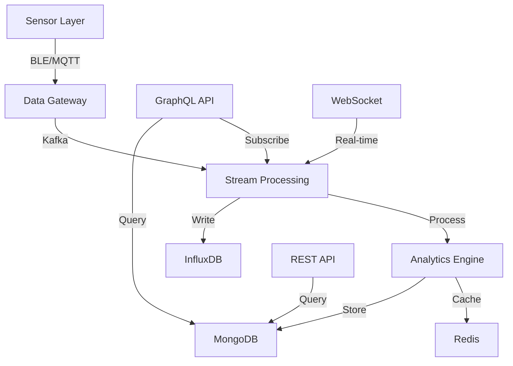

# Smart Apparel Backend Service

Enterprise-grade backend service for real-time biomechanical monitoring and analytics.

## Quick Start

```bash
# Install dependencies
npm install

# Start development server
npm run dev

# Build for production
npm run build

# Start production server
npm start
```

## Overview

The Smart Apparel Backend Service provides real-time processing and analytics for biomechanical sensor data, supporting comprehensive athletic performance monitoring and injury prevention.

### Key Features

- Real-time sensor data processing
- Advanced biomechanical analytics
- HIPAA-compliant data storage
- GraphQL and REST APIs
- Real-time WebSocket subscriptions
- Multi-tenant architecture
- Horizontal scalability

## Prerequisites

- Node.js ≥18.0.0
- npm ≥9.0.0
- Docker ≥24.0.0
- Kubernetes ≥1.27
- MongoDB ≥6.0
- InfluxDB ≥2.6
- Redis ≥7.0

## Installation

1. Clone the repository
```bash
git clone https://github.com/your-org/smart-apparel-backend.git
cd smart-apparel-backend
```

2. Set up environment variables
```bash
cp .env.example .env
# Edit .env with your configuration
```

3. Install dependencies
```bash
npm install
```

4. Start development environment
```bash
docker-compose up -d
npm run dev
```

## Architecture



### Component Details

- **Data Gateway**: Handles sensor data ingestion using MQTT/BLE protocols
- **Stream Processing**: Real-time data processing using Kafka
- **Analytics Engine**: Biomechanical analysis and anomaly detection
- **Time Series DB**: InfluxDB for sensor data storage
- **Document Store**: MongoDB for user/team data
- **Cache Layer**: Redis for session and real-time data

## Development

### Project Structure

```
src/
├── analytics/     # Analytics and ML processing
├── config/        # Configuration management
├── db/           # Database models and migrations
├── graphql/      # GraphQL schema and resolvers
├── interfaces/   # TypeScript interfaces
├── middleware/   # Express/Fastify middleware
├── monitoring/   # Logging and metrics
├── rest/         # REST API endpoints
├── sensors/      # Sensor data processing
├── services/     # Business logic services
├── utils/        # Utility functions
└── server.ts     # Application entry point
```

### Development Commands

```bash
# TypeScript compilation watch mode
npm run dev

# Run tests
npm test

# Run linting
npm run lint

# Format code
npm run format

# Type checking
npm run typecheck
```

## Testing

- Unit tests: Jest
- Integration tests: Supertest
- GraphQL testing: Apollo Server Testing
- Coverage threshold: 80%

```bash
# Run all tests
npm test

# Watch mode
npm run test:watch

# Coverage report
npm test -- --coverage
```

## Deployment

### Production Build

```bash
# Clean build directories
npm run clean

# Build production assets
npm run build

# Start production server
npm start
```

### Docker Deployment

```bash
# Build container
docker build -t smart-apparel-backend .

# Run container
docker run -p 3000:3000 smart-apparel-backend
```

### Kubernetes Deployment

```bash
# Apply configuration
kubectl apply -f k8s/

# Check deployment status
kubectl get pods -n smart-apparel
```

## Security

### Authentication Methods

- JWT-based authentication
- OAuth 2.0 support
- SAML SSO integration
- MFA capability

### Data Protection

- AES-256-GCM encryption at rest
- TLS 1.3 for data in transit
- Field-level encryption for PII
- HIPAA compliance measures

### Security Features

- Rate limiting
- CORS protection
- Helmet security headers
- SQL injection prevention
- XSS protection
- CSRF tokens

## API Documentation

### GraphQL API

- Endpoint: `/graphql`
- Playground: `/graphql` (development only)
- Documentation: `/graphql/docs`

### REST API

- Base URL: `/api/v1`
- OpenAPI Spec: `/api/docs`
- Swagger UI: `/api/docs/ui`

## Monitoring

### Observability Stack

- Metrics: Prometheus
- Logging: Winston + ELK Stack
- Tracing: OpenTelemetry
- Visualization: Grafana

### Health Checks

- Endpoint: `/health`
- Detailed status: `/health/detailed`
- Metrics: `/metrics`

## Troubleshooting

### Common Issues

1. Connection Issues
```bash
# Check service status
docker-compose ps

# View logs
docker-compose logs -f
```

2. Performance Issues
```bash
# Monitor resource usage
docker stats

# Check application metrics
curl localhost:3000/metrics
```

## Contributing

1. Fork the repository
2. Create a feature branch
3. Commit changes
4. Push to the branch
5. Create a Pull Request

### Code Style

- ESLint configuration
- Prettier formatting
- TypeScript strict mode
- Conventional commits

### Review Process

1. Code review required
2. CI checks must pass
3. Documentation updated
4. Tests included

## License

Copyright © 2023 Smart Apparel Inc.